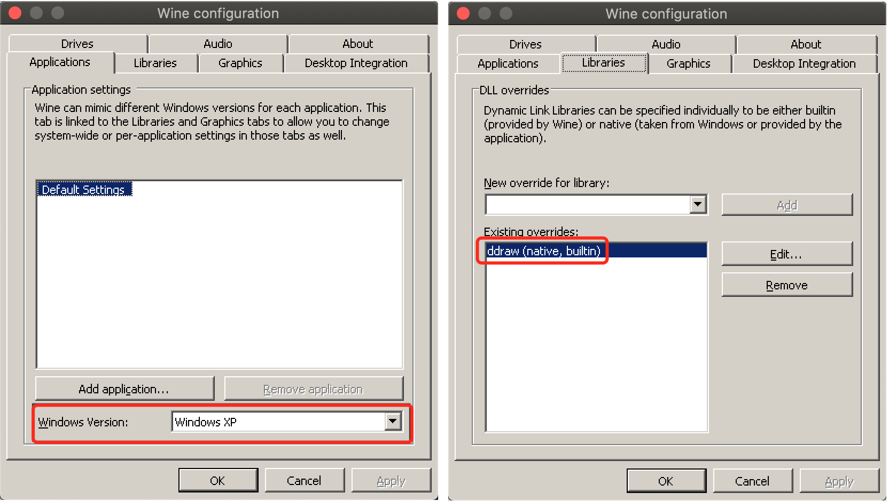
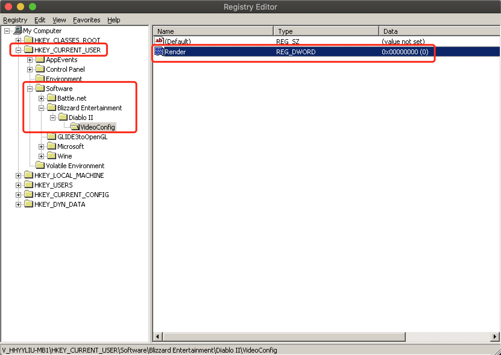
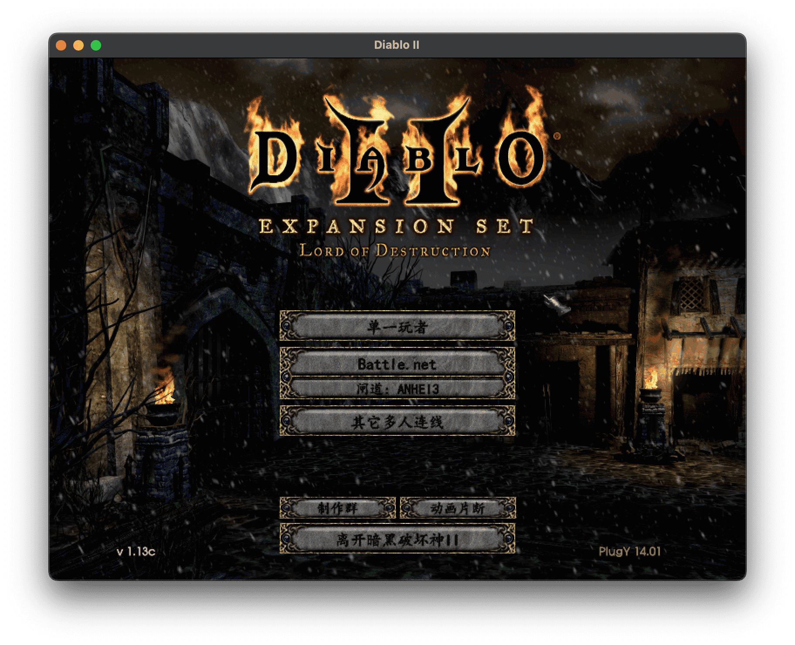

## 写在前面

笔者作为80后，至今仍然对于青春时代曾经伴随着我们的经典游戏念念不忘。暗黑破坏神、魔兽争霸、重返德军总部。。。那毕竟是我们这一代的青春。即使我现在玩不动了，但笔记本电脑中依然保留着这些游戏，偶尔玩一下怀念怀念也好。

我的笔记本现在已经换成 MacBook Pro，运行着 macOS Catalina 操作系统，曾经的经典游戏常规的方法依然无法继续运行了。当然你可能会说，安装一个虚拟机系统，里面跑一个 Windows XP 也可以玩了。这当然可以做到，但是它太重了，而且中间隔着一个虚拟化层，运行效率自然不高。作为搞 IT 的，怎么可以止步于此？

本次介绍一种使用 Wine 运行经典游戏的方法，教程适用于 macOS 操作系统，但思路也适用于 Linux。

<!-- more -->

## Wine 简介

来自维基百科：Wine通过提供一个[兼容层](https://zh.wikipedia.org/wiki/兼容层)来将Windows的系统调用转换成与POSIX标准的系统调用。它还提供了Windows系统运行库的替代品和一些系统组件的替代品。为了避免著作权问题，Wine主要使用黑箱测试逆向工程来编写。

说白了 Wine 和虚拟机的玩法有本质上的区别，Wine 是操作系统层的 API 调用转换，并没有虚拟层，因此运行效率上比虚拟机方式会高很多。

## macOS 下安装 Wine

本次我们将使用 Homebrew 来安装 Wine，Homebrew 是 macOS 下最流行的包管理器，如果您还没有安装 Homebrew，请访问 [Homebrew 官网](https://brew.sh/)详细了解，或者直接在终端使用以下命令进行安装：

```bash
$ /bin/bash -c "$(curl -fsSL https://raw.githubusercontent.com/Homebrew/install/HEAD/install.sh)"
```

接下来我们使用 Homebrew 来安装 Wine:

```bash
$ sudo spctl --master-disable # 允许未知来源的软件安装
$ brew tap gcenx/wine
$ brew cask install --no-quarantine wine-crossover
```

## 配置 Wine

我们的目标是运行 Windows 下的经典游戏，因此此处所有的配置都是针对这个目标进行的。接下来我们开始配置 Wine 环境。

### 初始化 Wine

我们准备将 Wine 的主目录存储在 `$HOME/.wine/` 下，在终端执行一下命令：

```bash
$ WINEPREFIX=$HOME/.wine winecfg
```

此时 WIne 会启动一个包含若干标签页的配置窗口，我们需要设置以下内容：

| 标签页       | 属性                     | 值         | 备注                    |
| ------------ | ------------------------ | ---------- | ----------------------- |
| Applications | WIndows Version          | Windows XP |                         |
| Libraries    | New override for library | ddraw      | 然后点击 `Add` 按钮添加 |

配置窗口截图如下所示：



设置完成之后，点击 `OK` 按钮保存设置，此时 Wine 的主目录 `$HOME/.wine` 的目录结构看起来是这样的：

```
.
├── dosdevices
│   ├── c: -> ../drive_c
│   └── z: -> /
├── drive_c
│   ├── Program Files
│   ├── ProgramData
│   ├── users
│   └── windows
├── system.reg
├── user.reg
└── userdef.reg
```

至此，Wine 所有的安装和配置工作全部结束，接下来就是如何在 Wine 中运行经典的游戏了。

### 解决中文乱码

在终端的 shell 配置文件中为 `wine64` 添加别名 `wine`，如下：

```bash
alias wine="env LC_ALL=zh_CN.UTF-8 wine64"
```

### 汇总配置项

将以上配置项汇总后保存在 `$HOME/.bashrc` 中，如果当前安装的 shell 是 zsh 的话，则保存在 `$HOME/.zshrc`

```bash
# 解决报错：terminals database is inaccessible
export TERMINFO=/usr/share/terminfo
# 禁止在终端输出所有调试信息
export WINEDEBUG=-all
# Wine 主目录
export WINEPREFIX=~/.wine
# 解决中文乱码并创建别名
alias wine="env LC_ALL=zh_CN.UTF-8 wine64"
```


## 运行经典游戏

### Diablo II

我们以 Diablo II 为例来进行说明，首先进入目录 `$HOME/.wine/drive_c` ，然后新建目录 `games`：

```bash
$ cd $HOME/.wine/drive_c
$ mkdir games
```

之后，下载免安装版的 Diablo II 游戏到 `$HOME/.wine/drive_c/games/Diablo II`，相信你可以很容易下载到的 :)

然后打开注册表，增加注册表项 `KEY_CURRENT_USER\Software\Blizzard Entertainment\Diablo II\VideoConfig` 并设置该项的类型为 REG_DWORD，值为 `0`：



在终端启动 Diablo II：

```bash
$ alias d2="cd $HOME/.wine/drive_c/games/Diablo\ II && wine Game.exe -w -direct -txt"
$ d2
```



至此，Diablo II 游戏的基本设置就已经全部完成。其他的经典游戏步骤类似，笔者已经测试通过了如下经典游戏：

- 暗黑破坏神 II
- 重返德军总部
- 魔兽争霸 III （过场动画会报错）

## 附录：终端环境配置汇总

追加如下配置到 `$HOME/.zshrc` 或者 `$HOME/.bashrc`

```bash
# Fix error `terminals database is inaccessible`
export TERMINFO=/usr/share/terminfo
# Disable debugging message output
export WINEDEBUG=-all
# Set up wine home directory
export WINEPREFIX=~/.wine
export WINEGAMEHOME="$WINEPREFIX/drive_c/games"
alias wine="env LC_ALL=zh_CN.UTF-8 wine"
alias d2="cd $WINEGAMEHOME/Diablo\ II && wine Game.exe -w -direct -txt"
```

## 参考链接

- [D2QOL | Mac OSX](https://github.com/whipowill/d2-plugy-qol/blob/master/Guides/MacOSX.md)
- [D2QOL | Video](https://github.com/whipowill/d2-plugy-qol/blob/master/Guides/Video.md)
- [macOS Mojave下解决wine中文乱码问题](https://blog.csdn.net/Y1575071736/article/details/91356917)
- [terminals database is inaccessible 解决办法 | CSDN](https://blog.csdn.net/qq_29695701/article/details/90715653)
- [Debug Channels - WineHQ Wiki](https://wiki.winehq.org/Debug_Channels)

