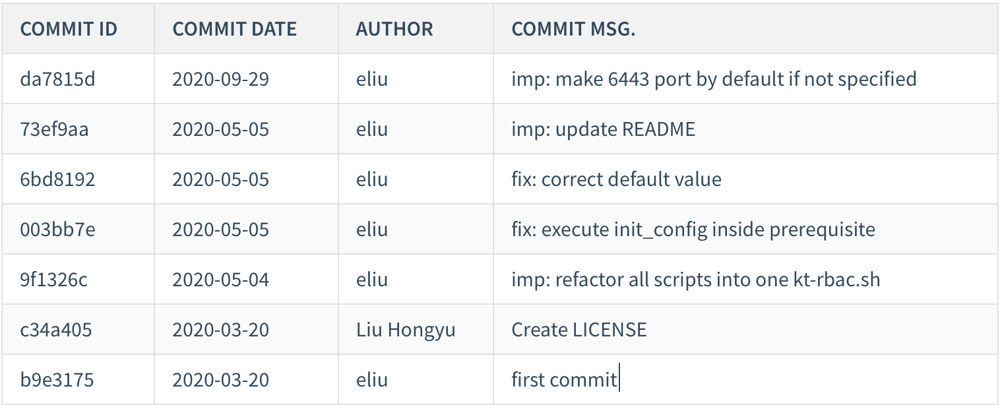

如今 Markdown 格式的文档在技术领域无处不在，尤其是在开源工具和技术文档方面，例如 GitHub、GitLab 等等基于 Git 的版本控制平台。一般情况下，Git 使用 `git-log` 来生成两次提交之间的变更日志信息。有时我们希望将此次版本发布的更新日志抽取出来，以 markdown 格式作为发布的版本的变更日志内容。

<!-- more -->

### git-log

以下是我们利用 git-log 命令格式化出来一段 [eliu/kt-connect-rbac](https://github.com/eliu/kt-connect-rbac) 仓库的变更日志：

```shell
$ git log --no-merges --format="%h %ad %an %s" --date=short HEAD
da7815d 2020-09-29 eliu imp: make 6443 port by default if not specified
73ef9aa 2020-05-05 eliu imp: update README
6bd8192 2020-05-05 eliu fix: correct default value
003bb7e 2020-05-05 eliu fix: execute init_config inside prerequisite
9f1326c 2020-05-04 eliu imp: refactor all scripts into one kt-rbac.sh
c34a405 2020-03-20 Liu Hongyu Create LICENSE
b9e3175 2020-03-20 eliu first commit
```

其中 `--no-merges` 表示通过 Merge 请求所产生的提交可忽略，`--date=short` 表示以简短的日期格式输出(yyyy-mm-dd)，`--format="xxxxx"` 表示日志输出的格式模板，具体可输入 `git log --help` 了解详细的占位符含义。

### 加工成 Markdown 格式

我们将 `--format` 选项稍加调整即可变成符合 markdown 格式的表格内容，例如：

```shell
# --format="| %h | %ad | %an | %s |"
```

再辅以表格的标题内容即可变成完整的 MD 格式的变更日志内容：



### changelog.sh

根据以上的思路，我这里写了一个可以在终端快速生成 Markdown 格式的变更日志的脚本 changelog.sh，使用方法如下：

```shell
$ changelog.sh --help

USAGE
    changelog.sh [--since [VERSION]] [--until [VERSION]]

OPTIONS
    -h | --help)      Print help
    -v | --version)   Print version info
    -p | --prefix)    If provided, search all sub-folders with this prefix.
                      Otherwise process current directory.
    -s | --since)     Commit id from
    -u | --until)     Commit id to

EXAMPLES
    1. Generate all change logs between 1.0.1 and 1.0.2

        $ changelog.sh --since 1.0.1 --until 1.0.2

    2. Generate all change logs of version 1.0.2 from the very beginning

        $ changelog.sh --until 1.0.2

    3. Generate all change logs since version 1.0.2

        $ changelog.sh --since 1.0.2

```

脚本可以为当前所在的git仓库目录生成变更日志文件，也支持将一组相似的仓库批量生成变更日志，例如：

```shell
$ changelog.sh --prefix kt --until HEAD
[INFO] CHANGELOG will be written to file CHANGELOG-HEAD.md
[INFO] Appending change logs for kt-connect-rbac ...
```

此时在脚本所在的目录中生成了一个 Markdown 格式的日志文件 `CHANGELOG-HEAD.md`, 使用 Markdown 编辑器打开该文件即可得到上面截图的效果。脚本提供了 `--prefix`, `--since` 和 `--until` 选项可以使用。

项目地址：[eliu/git-log-markdown: Generate a markdown format change-log file for git repos. (github.com)](https://github.com/eliu/git-log-markdown)

