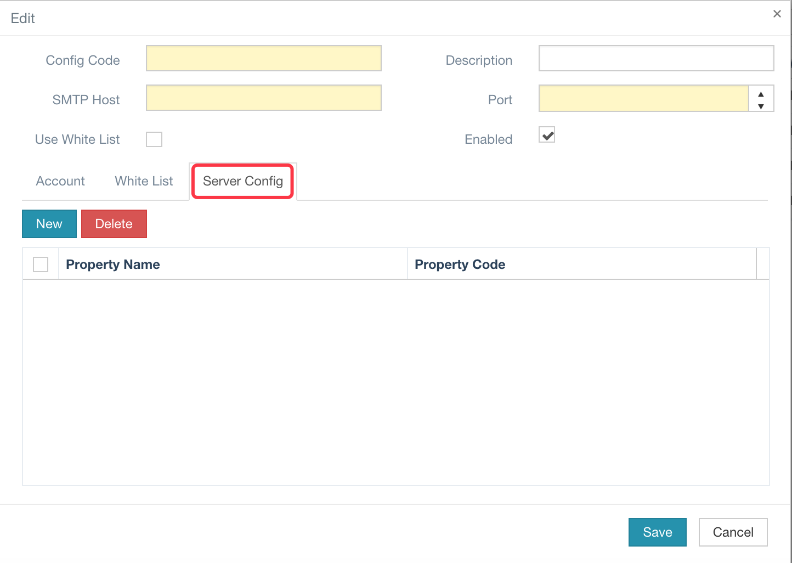

HAP 默认提供一套完整的邮件发送 API 和若干邮件设置功能，其中就包括邮件账户设置功能。这个功能允许你在HAP 中配置多个邮件账户，每个邮件账户可于一个或多个邮件模板进行绑定，我们按需进行配置即可。

> 更多关于邮件功能的信息请访问：
>
> http://eco.hand-china.com/doc/hap/latest/user_guide/system/email.html

这里重点说一下如何配置一个启用 SSL 的邮件账户。通常情况下，它的配置端口为 `465`，同时还需要进行额外的服务器属性配置，这个配置界面在邮件账户编辑页面下方的 Server Config 或服务器设置标签页中，如下图所示：

<!-- more -->

此处有以下几个固定的属性需要设置，详见下表：

| 属性                             | 值                             |
| -------------------------------- | ------------------------------ |
| mail.smtp.auth                   | true                           |
| mail.smtp.port                   | 465                            |
| mail.smtp.ssl.enable             | true                           |
| mail.smtp.socketFactory.class    | javax.net.ssl.SSLSocketFactory |
| mail.smtp.socketFactory.fallback | false                          |
| mail.smtp.socketFactory.port     | 465                            |

属性设置完成之后，其他设置按照正常步骤完成即可。

> **注意：**目前 Yahoo! 邮箱未能通过测试，如有进一步修复，我会同步在此处进行更新。