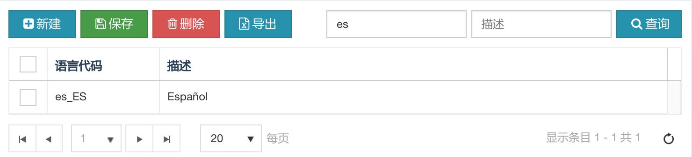

## HAP 简介

汉得应用开发平台（HAND Application Platform）是汉得公司为了应对移动互联网化、应用云端化、海量数据化和数字化服务转型的应用开发平台，是中台化产品和应用开发的基础平台。HAP采用开源的Java EE技术体系，平台设计灵活可扩展、可移植、可应对高并发需求。

> 更多信息请访问：http://eco.hand-china.com/platform/hap.html

<!-- more -->

## 启用新语言

HAP 应用开发平台默认支持简体中文和英语两种语言，如果要启用新的语言支持，比如西班牙语，则需要找到所有国际化相关的前后端对象进行翻译。

幸运的是，HAP 应用开发平台对国际化提供了良好的框架支持和开发规范，所以涉及到和多语言或者国际化相关的数据表和其他资源对象的分布相对集中且有规律可循，具体分三部分：

1. 多语言描述总表 `SYS_PROMPTS`
2. 所有平台和功能页面的实体对象所关联的多语言表 `*_TL`
3. KendoUI 国际化支持文件 `kendo.culture.<locale>.js` 和 `kendo.messages.<locale>.js`

下面以西班牙语为例，详细说明整个过程。


### 1. 定义语言代码

进入 `系统管理` > `语言维护` 新增西班牙语言代码 `es_ES`



### 2. 适配 KendoUI 国际化资源文件

按照下表将指定的资源文件拷贝到对应目录下：

| 源文件路径                                                  | 拷贝后的路径                                               |
| ----------------------------------------------------------- | ---------------------------------------------------------- |
| target/core/lib/kendoui/js/messages/kendo.messages.en-GB.js | src/webapp/lib/kendoui/js/messages/kendo.messages.es-ES.js |
| target/core/lib/kendoui/js/cultures/kendo.culture.en-GB.js  | src/webapp/lib/kendoui/js/cultures/kendo.culture.es-ES.js  |

### 3. 更新数据库记录

使用 en_GB 下的语言记录来更新所有的国际化表，脚本如下：

```sql
-- ========================================================
-- Insert all Spanish records based on original en_GB
--
-- Creation Date : 2018-10-08
-- Created By    : memories.liu@hand-china.com
-- Script Version: 1.0.0
-- HAP Version   : 3.5.0-RELEASE
--
-- ========================================================
-- System Prompt table:
--   SYS_PROMPTS
-- Multi-lingual tables listed below:
--   FND_COMPANY_TL
--   HR_ORG_POSITION_TL
--   HR_ORG_UNIT_TL
--   SYS_ATTACH_CATEGORY_TL
--   SYS_CODE_TL
--   SYS_CODE_VALUE_TL
--   SYS_DASHBOARD_TL
--   SYS_FUNCTION_TL
--   SYS_HOTKEY_TL
--   SYS_IF_CONFIG_HEADER_TL
--   SYS_IF_CONFIG_LINE_TL
--   SYS_RESOURCE_ITEM_TL
--   SYS_RESOURCE_TL
--   SYS_ROLE_TL
-- ========================================================

-- sys_prompts
insert into sys_prompts (
  prompt_id,
  prompt_code,
  lang,
  description,
  object_version_number
)
select 
  SYS_PROMPTS_S.NEXTVAL,
  prompt_code,
  'es_ES',
  description,
  object_version_number
from sys_prompts where lang = 'en_GB';

-- FND_COMPANY_TL
INSERT INTO FND_COMPANY_TL(
    COMPANY_ID,
    LANG,
    COMPANY_SHORT_NAME,
    COMPANY_FULL_NAME
) SELECT 
    COMPANY_ID,
    'es_ES',
    COMPANY_SHORT_NAME,
    COMPANY_FULL_NAME
FROM FND_COMPANY_TL WHERE LANG = 'en_GB';

-- HR_ORG_POSITION_TL
INSERT INTO HR_ORG_POSITION_TL(
    POSITION_ID,
    LANG,
    NAME,
    DESCRIPTION
) SELECT 
    POSITION_ID,
    'es_ES',
    NAME,
    DESCRIPTION
FROM HR_ORG_POSITION_TL WHERE LANG = 'en_GB';

-- HR_ORG_UNIT_TL
INSERT INTO HR_ORG_UNIT_TL(
    UNIT_ID,
    LANG,
    NAME,
    DESCRIPTION
) SELECT 
    UNIT_ID,
    'es_ES',
    NAME,
    DESCRIPTION
FROM HR_ORG_UNIT_TL WHERE LANG = 'en_GB';

-- SYS_ATTACH_CATEGORY_TL
INSERT INTO SYS_ATTACH_CATEGORY_TL(
    CATEGORY_ID,
    LANG,
    CATEGORY_NAME,
    DESCRIPTION
) SELECT 
    CATEGORY_ID,
    'es_ES',
    CATEGORY_NAME,
    DESCRIPTION
FROM SYS_ATTACH_CATEGORY_TL WHERE LANG = 'en_GB';

-- SYS_CODE_TL
INSERT INTO SYS_CODE_TL(
    CODE_ID,
    LANG,
    DESCRIPTION
) SELECT 
    CODE_ID,
    'es_ES',
    DESCRIPTION
FROM SYS_CODE_TL WHERE LANG = 'en_GB';

-- SYS_CODE_VALUE_TL
INSERT INTO SYS_CODE_VALUE_TL(
    CODE_VALUE_ID,
    LANG,
    MEANING,
    DESCRIPTION
) SELECT 
    CODE_VALUE_ID,
    'es_ES',
    MEANING,
    DESCRIPTION
FROM SYS_CODE_VALUE_TL WHERE LANG = 'en_GB';

-- SYS_DASHBOARD_TL
INSERT INTO SYS_DASHBOARD_TL(
    DASHBOARD_ID,
    LANG,
    TITLE,
    DESCRIPTION
) SELECT 
    DASHBOARD_ID,
    'es_ES',
    TITLE,
    DESCRIPTION
FROM SYS_DASHBOARD_TL WHERE LANG = 'en_GB';


-- SYS_FUNCTION_TL
INSERT INTO SYS_FUNCTION_TL(
    FUNCTION_ID,
    LANG,
    FUNCTION_NAME,
    FUNCTION_DESCRIPTION
) SELECT 
    FUNCTION_ID,
    'es_ES',
    FUNCTION_NAME,
    FUNCTION_DESCRIPTION
FROM SYS_FUNCTION_TL WHERE LANG = 'en_GB';

-- SYS_HOTKEY_TL
INSERT INTO SYS_HOTKEY_TL(
    HOTKEY_ID,
    LANG,
    DESCRIPTION
) SELECT 
    HOTKEY_ID,
    'es_ES',
    DESCRIPTION
FROM SYS_HOTKEY_TL WHERE LANG = 'en_GB';

-- SYS_IF_CONFIG_HEADER_TL
INSERT INTO SYS_IF_CONFIG_HEADER_TL(
    HEADER_ID,
    LANG,
    NAME,
    DESCRIPTION
) SELECT 
    HEADER_ID,
    'es_ES',
    NAME,
    DESCRIPTION
FROM SYS_IF_CONFIG_HEADER_TL WHERE LANG = 'en_GB';

-- SYS_IF_CONFIG_LINE_TL
INSERT INTO SYS_IF_CONFIG_LINE_TL(
    LINE_ID,
    LANG,
    LINE_NAME,
    LINE_DESCRIPTION
) SELECT 
    LINE_ID,
    'es_ES',
    LINE_NAME,
    LINE_DESCRIPTION
FROM SYS_IF_CONFIG_LINE_TL WHERE LANG = 'en_GB';

-- SYS_RESOURCE_ITEM_TL
INSERT INTO SYS_RESOURCE_ITEM_TL(
    RESOURCE_ITEM_ID,
    LANG,
    ITEM_NAME,
    DESCRIPTION
) SELECT 
    RESOURCE_ITEM_ID,
    'es_ES',
    ITEM_NAME,
    DESCRIPTION
FROM SYS_RESOURCE_ITEM_TL WHERE LANG = 'en_GB';

-- SYS_RESOURCE_TL
INSERT INTO SYS_RESOURCE_TL(
    RESOURCE_ID,
    LANG,
    NAME,
    DESCRIPTION
) SELECT 
    RESOURCE_ID,
    'es_ES',
    NAME,
    DESCRIPTION
FROM SYS_RESOURCE_TL WHERE LANG = 'en_GB';

-- SYS_ROLE_TL
INSERT INTO SYS_ROLE_TL(
    ROLE_ID,
    LANG,
    ROLE_NAME,
    ROLE_DESCRIPTION
) SELECT 
    ROLE_ID,
    'es_ES',
    ROLE_NAME,
    ROLE_DESCRIPTION
FROM SYS_ROLE_TL WHERE LANG = 'en_GB';
```

### 4. 人工翻译

将所有西班牙语言下的字符串进行人工翻译，这包括 kendoui 的国际化资源文件和所有的国际化表的记录。

### 5. 清缓存并重启服务器

启动命令行工具 redis-cli 并连接至 Redis，执行以下命令清除 Redis 缓存：

```bash
flushall
```

重启 Tomcat 服务器。