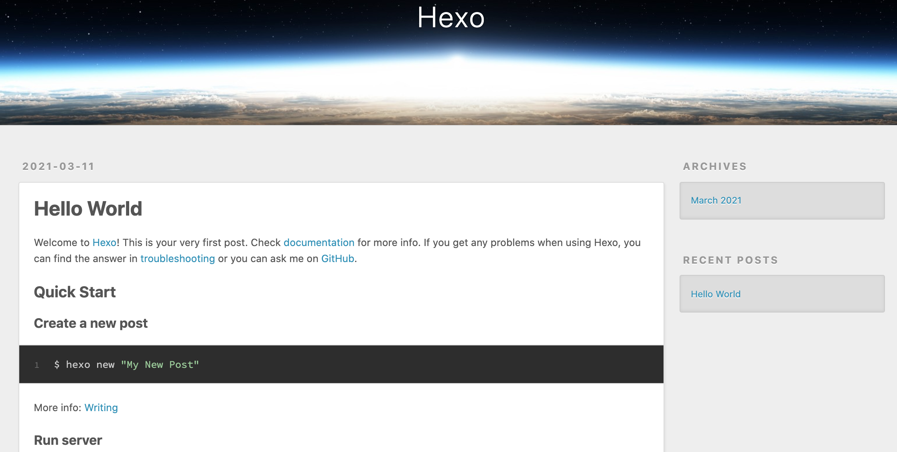

## [Hexo](https://hexo.io/zh-cn/) 简介

官网一句话概括就是“快速、简洁且高效的博客框架”，笔者的博客就是使用 Hexo 来搭建的，前期虽然踩过一些坑，但总体用下来看确实很方便。Hexo 社区有丰富的博客模板库和功能插件供用户下载和扩展，接下来就把笔者使用 Hexo 搭建博客的过程介绍一下。

<!-- more -->

## 搭建过程

### 安装 `hexo-cli`

```shell
$ npm install -g hexo-cli # 安装 hexo
```

### 新建博客项目

在一个空目录下执行 hexo 初始化命令会触发 hexo 从 GitHub 上下载 Hexo 项目骨架到当前目录下：

```shell
$ mkdir myblog
$ cd myblog
$ hexo init
INFO  Cloning hexo-starter https://github.com/hexojs/hexo-starter.git
INFO  Install dependencies
...
INFO  Start blogging with Hexo!
```

此时文件夹 myblog 的项目结构如下：

```
myblog
├── _config.landscape.yml
├── _config.yml
├── node_modules
├── package.json
├── scaffolds
├── source
├── themes
└── yarn.lock

4 directories, 4 files
```

此时执行 `hexo server` 命令会在本地启动博客，访问 http://localhost:4000 即可呈现：

```shell
$ hexo s
INFO  Validating config
INFO  Start processing
INFO  Hexo is running at http://localhost:4000 . Press Ctrl+C to stop.
```



### 插件安装

Hexo官方提供了丰富的插件来进行功能增强，读者可以访问 [Plugins | Hexo](https://hexo.io/plugins/) 来详细了解插件详情，这里我们准备安装以下三个插件以支持不同的功能特性，如下：

| 插件名称              | 作用                                                         |
| --------------------- | ------------------------------------------------------------ |
| hexo-generator-search | 启用全文搜索                                                 |
| hexo-deployer-git     | 支持将博客发布到基于Git的网站，如 GitHub Page，Gitee Pages 等等 |
| hexo-asset-link       | 使博客中的图片和链接可以正确显示                             |

在刚刚我们创建的博客主目录 myblog 下打开终端并执行以下命令：

```shell
npm install --save hexo-generator-search
npm install --save hexo-deployer-git
npm install --save hexo-asset-link
```

### 配置博客

`_config.yml` 是 Hexo 的核心配置文件我们要进行以下改动：

| 属性              | 值                      | 解释                                                  |
| ----------------- | ----------------------- | ----------------------------------------------------- |
| language          | zh-CN                   | 语言                                                  |
| timezone          | Asia/Shanghai           | 时区                                                  |
| url               | 例如 https://myblog.com | 博客域名，gitee page 需改为 https://xxx.gitee.io/blog |
| root              | /                       | 网站根目录，gitee page 需要改为 `/blog/`              |
| post_asset_folder | true                    | 自动为文章生成专属的资源文件夹                        |
| theme             | landscape               | 下载hexo主题包到themes目录，并更换主题名称            |
| deploy/type       | git                     |                                                       |
| deploy/repository | -                       | 根据实际情况制定Git仓库地址                           |
| deploy/branch     | master                  | 默认推送的分支                                        |

### 编写博客文章

```shell
$ hexo new post "Hello world"
# 使用 markdown 编辑器编辑 source/_posts/hello-world.md
```

### 推送更新

目前已验证通过的托管页面有 GitHub Pages 和 Gitee Pages：

```shell
$ hexo clean    # 清空之前生成内容
$ hexo generate # 生成静态页面
$ hexo deploy   # 推送更新至 Git 仓库
```

## 常见问题

### cannot get /categories/

默认情况下， hexo 并未自动为我们生成对应的分类和标签页面，我们可以按照如下方法依次启用分类和标签功能。

1. 新建一个页面，命名为 `categories` 。命令如下：

   ```shell
   hexo new page categories
   ```

2. 编辑刚新建的页面 (source/categories/index.md)，将页面的类型设置为 `categories` ，主题将自动为这个页面显示所有分类。

   ```markdown
   title: 分类
   date: 2014-12-22 12:39:04
   type: "categories"
   ---
   ```

3. 在菜单中添加链接。编辑主题的 `_config.yml` ，将 `menu` 中的 `categories: /categories` 注释去掉，如下:

   ```yaml
    menu:
      home: /
      categories: /categories
      archives: /archives
      tags: /tags
   ```

启用标签功能类似，只需要把类型改为 `tags`。


## 参考链接

- [How to Add Image to Hexo Blog Post | LIOLOG (liolok.github.io)](https://liolok.github.io/How-to-Add-Image-to-Hexo-Blog-Post/)
- [Tags/Categories 访问 404（hexo-theme-next）](https://github.com/iissnan/hexo-theme-next/wiki/%E5%88%9B%E5%BB%BA%E5%88%86%E7%B1%BB%E9%A1%B5%E9%9D%A2)

