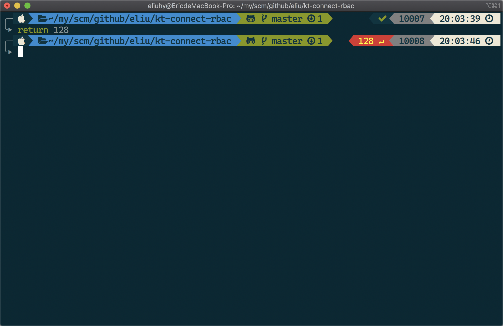
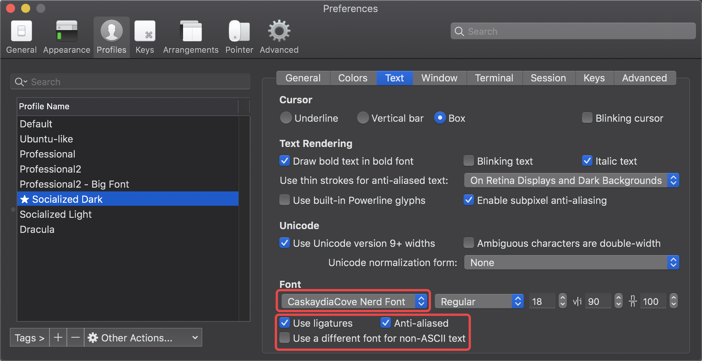

## 预期效果

本文将介绍结合 `iTerm2` 和 `Oh My Zsh` 来美化 macOS 下的显示效果，先放一张最终效果图：



接下来我们来看下针对 iTerms2 终端进行美化的具体步骤。
<!-- more -->


## 具体步骤

### 0x00 下载软件

- iTerm2: https://iterm2.com/downloads.html
- Oh My Zsh (OMZ): https://ohmyz.sh/

#### 安装 OMZ

```shell
$ sh -c "$(curl -fsSL https://raw.github.com/ohmyzsh/ohmyzsh/master/tools/install.sh)"
```


### 0x01 安装 OMZ 插件

#### 下载插件

```shell
# 下载 OMZ 插件 zsh-syntax-highlighting
# https://github.com/zsh-users/zsh-syntax-highlighting/blob/master/INSTALL.md
git clone https://github.com/zsh-users/zsh-syntax-highlighting.git ${ZSH_CUSTOM:-~/.oh-my-zsh/custom}/plugins/zsh-syntax-highlighting

# 下载 OMZ 插件 zsh-autosuggestions
# https://github.com/zsh-users/zsh-autosuggestions/blob/master/INSTALL.md
git clone https://github.com/zsh-users/zsh-autosuggestions ${ZSH_CUSTOM:-~/.oh-my-zsh/custom}/plugins/zsh-autosuggestions
```

#### 启用插件

打开 `$HOME/.zshrc` 加入以下脚本内容：

```shell
plugins=(
  git
  autojump
  osx
  zsh-syntax-highlighting
  zsh-autosuggestions
)
```


### 0x02 安装 Nerd Fonts

整个 Nerd Font 仓库将近 1G 大小，其中 99% 部分都是我们不需要的，因此我们没必要将整个仓库克隆至本地。我这里推荐使用的字体是 Adobe 的 `Source Code Pro` 和 微软公司的 `Cascadia Code`。为支持更丰富的显示，Nerd Font 提供了这两个字体的补丁字体（Patched Font），下载地址如下：

- [Sauce Code Pro Nerd Font](https://github.com/ryanoasis/nerd-fonts/blob/master/patched-fonts/SourceCodePro/Regular/complete/Sauce%20Code%20Pro%20Nerd%20Font%20Complete.ttf)
- [Caskaydia Cove Regular Nerd Font](https://github.com/ryanoasis/nerd-fonts/blob/master/patched-fonts/CascadiaCode/complete/Caskaydia%20Cove%20Regular%20Nerd%20Font%20Complete.ttf)


### 0x03 配置 iTerm2

`⌘`+`,` 打开 iTerm2 的设置界面，选择你当前的配置文件，这里推荐使用 `Socialized Dark`，之后按照如图所示选择正确的补丁字体，并勾选必要的勾选项：




### 0x04 安装和配置 powerlevel9k 主题

我们根据[官方指引](https://github.com/Powerlevel9k/powerlevel9k/wiki/Install-Instructions#option-2-install-for-oh-my-zsh)来为 OMZ 安装 powerlevel9k 主题：

```shell
$ git clone https://github.com/bhilburn/powerlevel9k.git ~/.oh-my-zsh/custom/themes/powerlevel9k
```

编辑 `$HOME/.zshrc` 文件，并加入以下内容：

```shell
POWERLEVEL9K_MODE='nerdfont-complete'
POWERLEVEL9K_PROMPT_ON_NEWLINE=true
POWERLEVEL9K_MULTILINE_LAST_PROMPT_PREFIX="╰▸ "
POWERLEVEL9K_LEFT_PROMPT_ELEMENTS=(os_icon dir vcs)
ZSH_THEME="powerlevel9k/powerlevel9k"
```

具体的参数解释可参见 powerlevel9k 的 [Wiki](https://github.com/Powerlevel9k/powerlevel9k/wiki/Stylizing-Your-Prompt)，最后就会得到文章开头的“预期效果”！