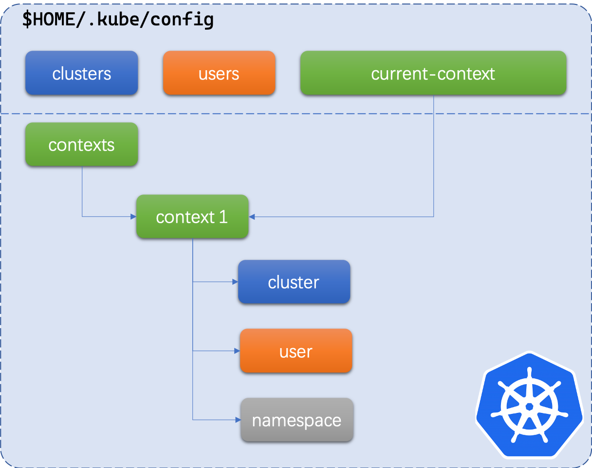

## 前言

Kubernetes 集群在服务器搭建部署成功之后，通常我们都会通过 `kubectl` 命令行工具与集群互动、发送操作指令来管理集群。`kubectl` 主要依赖于集群配置文件 `kubeconfig` 与集群进行通讯，这个文件通常在 Kubernetes 集群的 master 节点服务器的 `$HOME/.kube/config` 目录下。开发者可以从服务器获取改配置文件到开发者本地电脑上的相同目录位置上即可。

本篇文章主要介绍一下我们如何管理这个配置文件。如果熟悉 `kubeconfig` 文件的结构，读者当然可以使用文本编辑器自行修改，不过手工修改难免会有错误和不便。所以这里介绍一下如何利用 `kubectl` 工具来帮助我们管理和调整配置文件。


<!-- more -->

## kubeconfig 的结构

kubeconfig 是一个 Kubernetes 中的一个资源对象，叫做 `Config` , 内容格式是 YAML 。这个文件中主要包含了集群（clusters）、上下文（contexts）和用户（users）信息，他们的层次结构和关系如下图所示：



如图所示，上下文 context 是建立集群、用户和命名空间之间关系的桥梁和纽带，我们在本地切换所谓的“环境”其实就是将一个指定的上下文为当前激活的上下文（current-context）。再通俗点讲，这个上下文指的就是你当前是以什么身份（user) 在连接哪个集群（cluster），连接后自动切换到哪一个命名空间（namespace）下。

## kubectl config

`kubectl` 中的 `config` 子命令可以帮助我们维护存储在本地的配置文件，我们先来看下它的帮助说明：

```shell
$ kubectl config --help
Modify kubeconfig files using subcommands like "kubectl config set current-context my-context"

 The loading order follows these rules:

  1.  If the --kubeconfig flag is set, then only that file is loaded. The flag may only be set once and no merging takes
place.
  2.  If $KUBECONFIG environment variable is set, then it is used as a list of paths (normal path delimiting rules for
your system). These paths are merged. When a value is modified, it is modified in the file that defines the stanza. When
a value is created, it is created in the first file that exists. If no files in the chain exist, then it creates the
last file in the list.
  3.  Otherwise, ${HOME}/.kube/config is used and no merging takes place.

Available Commands:
  current-context Displays the current-context
  delete-cluster  Delete the specified cluster from the kubeconfig
  delete-context  Delete the specified context from the kubeconfig
  get-clusters    Display clusters defined in the kubeconfig
  get-contexts    Describe one or many contexts
  rename-context  Renames a context from the kubeconfig file.
  set             Sets an individual value in a kubeconfig file
  set-cluster     Sets a cluster entry in kubeconfig
  set-context     Sets a context entry in kubeconfig
  set-credentials Sets a user entry in kubeconfig
  unset           Unsets an individual value in a kubeconfig file
  use-context     Sets the current-context in a kubeconfig file
  view            Display merged kubeconfig settings or a specified kubeconfig file

Usage:
  kubectl config SUBCOMMAND [options]

Use "kubectl <command> --help" for more information about a given command.
Use "kubectl options" for a list of global command-line options (applies to all commands).
```

这里简要说明一下config下几个主要的子命令：

| 子命令            | 说明                                                        | 备注       |
| ----------------- | ----------------------------------------------------------- | ---------- |
| `current-context` | 显示当前的上下文名称                                        |            |
| `use-context`     | 指定某个上下文为当前激活的上下文                            |            |
| `rename-context`  | 重命名一个上下文                                            |            |
| `delete-context`  | 从 kubeconfig 中删除指定的上下文                            |            |
| `delete-cluster`  | 从 kubeconfig 中删除指定的集群                              |            |
| `set`             | 设置 kubeconfig 中一个具体的属性的值                        |            |
| `set-cluster`     | 设置指定集群的属性                                          |            |
| `set-context`     | 设置指定上下文的属性                                        |            |
| `set-credentials` | 设置指定用户的属性                                          | 无法删除   |
| `unset`           | 删除 kubeconfig 中一个具体的属性的值                        | 可用于删除 |
| `view`            | 输出合并后的kubeconfig的内容，格式为 YAML，密文内容不会显示 |            |
| `get-clusters`    | 输出所有的集群信息                                          |            |
| `get-contexts`    | 输出所有的上下文信息，同时会标记哪一个是当前的上下文        |            |


## 常见任务场景

接下来我们列举一些常见的任务场景。

### 0x01 查看当前所有的集群

```shell
$ kubectl config get-clusters
NAME
kubernetes
```


### 0x02 修改集群服务器地址

首先我们使用以下命令来看下集群 kubernetes 的 server 属性的值：

```shell
$ kubectl config view -o jsonpath='{.clusters[?(@.name == "kubernetes")].cluster.server}'
http://127.0.0.1:8443
```

接下来我们是用 `set-cluster` 子命令来修改服务器的地址：

```shell
# 修改集群服务器地址为 https://192.168.1.10:8443
$ kubectl config set-cluster kubernetes --server=https://192.168.1.10:8443
Cluster "kubernetes" set.

# 再次查看集群的服务器地址
$ kubectl config view -o jsonpath='{.clusters[?(@.name == "kubernetes")].cluster.server}'
https://192.168.1.10:8443
```


### 0x03 删除一个集群

```shell
# 删除集群 docker-desktop
$ kubectl config delete-cluster docker-desktop
deleted cluster docker-desktop from /Users/eliuhy/.kube/config
```


### 0x04 删除一个用户

`kubectl config` 未直接提供的删除用户的子命令，所以我们找不到类似于 `delete-user` 之类的选项。不过我们可以使用 `unset` 子命令来完成这个任务：

```shell
# 删除用户 docker-desktop
$ kubectl config unset users.docker-desktop
Property "users.docker-desktop" unset.
```


### 0x05 查看当前所有的上下文

```shell
$ kubectl config get-contexts
CURRENT   NAME                          CLUSTER      AUTHINFO           NAMESPACE
*         kt-connect@kubernetes         kubernetes   kt-connect         default
          kubernetes-admin@kubernetes   kubernetes   kubernetes-admin   kube-system
```


### 0x06 删除上下文信息

```shell
# 删除上下文 docker-desktop
$ kubectl config delete-context docker-desktop
deleted context docker-desktop from /Users/eliuhy/.kube/config
```


### 0x07 更新上下文的命名空间

```shell
# 查看上下文 kubernetes-admin@kubernetes 的详细信息
$ kubectl config get-contexts kubernetes-admin@kubernetes
CURRENT   NAME                          CLUSTER      AUTHINFO           NAMESPACE
          kubernetes-admin@kubernetes   kubernetes   kubernetes-admin   default

# 修改上下文的命名空间为 kube-system
$ kubectl config set-context kubernetes-admin@kubernetes --namespace=kube-system
Context "kubernetes-admin@kubernetes" modified.

# 再次查看上下文信息
$ kubectl config get-contexts kubernetes-admin@kubernetes
CURRENT   NAME                          CLUSTER      AUTHINFO           NAMESPACE
          kubernetes-admin@kubernetes   kubernetes   kubernetes-admin   kube-system
```


### 0x08 修改当前激活的上下文

```shell
# 查看当前激活的上下文，CURRENT 列标记星号的为当前激活的上下文
$ kubectl config get-contexts
CURRENT   NAME                          CLUSTER      AUTHINFO           NAMESPACE
*         kt-connect@kubernetes         kubernetes   kt-connect         default
          kubernetes-admin@kubernetes   kubernetes   kubernetes-admin   kube-system

# 修改当前激活的上下文为 kubernetes-admin@kubernetes
$ kubectl config use-context kubernetes-admin@kubernetes
Switched to context "kubernetes-admin@kubernetes".

# 再次确认是否激活成功
$ kubectl config get-contexts
CURRENT   NAME                          CLUSTER      AUTHINFO           NAMESPACE
          kt-connect@kubernetes         kubernetes   kt-connect         default
*         kubernetes-admin@kubernetes   kubernetes   kubernetes-admin   kube-system
```


## 总结

建议大家使用 `kubectl config` 的方式来配置 `kubeconfig` 文件，避免了手工修改的麻烦和误配置之外，对于自动化管理也可以更加规范和统一。

