## 简介

OpenClaw（俗称“龙虾”） 是一款面向个人与轻量团队的低门槛 AI 自动化代理工具，前身为 Clawdbot、Moltbot，经过版本迭代与品牌整合后，2026年统一以“OpenClaw”作为官方名称，核心定位是通过自然语言指令，替代人工完成流程化、重复性工作，无需用户掌握编程技能，适配多场景自动化需求。 

从技术逻辑来看，OpenClaw 并非单一功能工具，而是一套“需求解析-任务规划-工具调用-结果反馈”的完整闭环系统。其核心依托大模型实现自然语言理解，接收用户指令后自动拆解任务、匹配关联工具或系统，执行完成后以清晰易懂的形式反馈结果。与传统自动化工具相比，OpenClaw 的核心优势的是“低门槛”与“高适配性”——无需编写脚本，日常语言即可下达指令；兼容云服务器、本地设备等多种运行环境，支持集成各类常用工具，灵活适配不同使用场景。

> [!note]
>
> 知乎上关于 OpenClaw 的介绍：[传送门](https://zhuanlan.zhihu.com/p/2001059709017408863)

接下来本文将详细介绍 OpenClaw 的安装步骤和避雷指南。

<!-- more -->

## 实验环境准备

优先选择一台“闲置”的 Mac 电脑（MacBook Pro/Air, Mac mini, iMac等等），要求 macOS 操作系统版本不能低于 **macOS 10.15 Catalina**，具体兼容信息请参考 **安装指引 > macOS 平台**章节的版本兼容性相关内容。

如果没有 macOS 环境的条件，也可以在 Windows 下通过安装 WSL2 (Ubuntu 24.04) 来体验如何在 Linux 环境下安装 OpenClaw。

由于我手上的电脑都没有独立显卡，无法在本地部署大模型，因此对于安装 OpenClaw 的机器硬件配置要求不高，以下配置作为参考：

| 配置属性 | 值                    |
| -------- | --------------------- |
| CPU      | 英特尔 i5 处理器, 4核 |
| 内存     | 8G                    |
| 显卡     | 核显 1.5G             |
| 硬盘     | 500G, SSD             |


## 安装指引

### macOS 平台

#### 安装 Homebrew

Homebrew 是 macOS 平台事实标准的包管理工具，类似于 Ubuntu 下的 apt, RHEL 下的 dnf。以下情况下用户可以忽略本节内容：

1. 你无法收到来自 Apple 官方的操作系统升级（那么 Homebrew 也不再提供支持）
2. 已经安装了 Homebrew


安装步骤相对简单，但网络要保持畅通~ 打开 Terminal 终端，执行以下命令：

```shell
/bin/bash -c "$(curl -fsSL https://raw.githubusercontent.com/Homebrew/install/HEAD/install.sh)"
```

检查 Homebrew 的版本：

```shell
$ brew --version
Homebrew 5.0.14
```


#### 安装 Node

**第一种方式**：使用 Homebrew 安装，我们以当前最新的 LTS 版本 22 为例，安装命令如下：

```
brew install node@22
```

注意，如果你的操作系统版本官方已不再支持的话，你会收到 Homebrew 的以下提醒，并且很有可能会通过源码编译的方式在本机安装软件和依赖。此时最好放弃这个安装方法，直接到 Node 官网寻找预编译的安装包。

> [!warning]
>
> Warning: You are using macOS 12. We (and Apple) do not provide support for this old version.

**第二种方式**：使用官方预编译的安装包，这里以 Node 22.x LTS 为例来说明，步骤如下：

一、浏览器访问 https://nodejs.org/dist/latest-v22.x/ 下载安装包： [node-v22.22.0.pkg](https://nodejs.org/dist/v22.22.0/node-v22.22.0.pkg) 

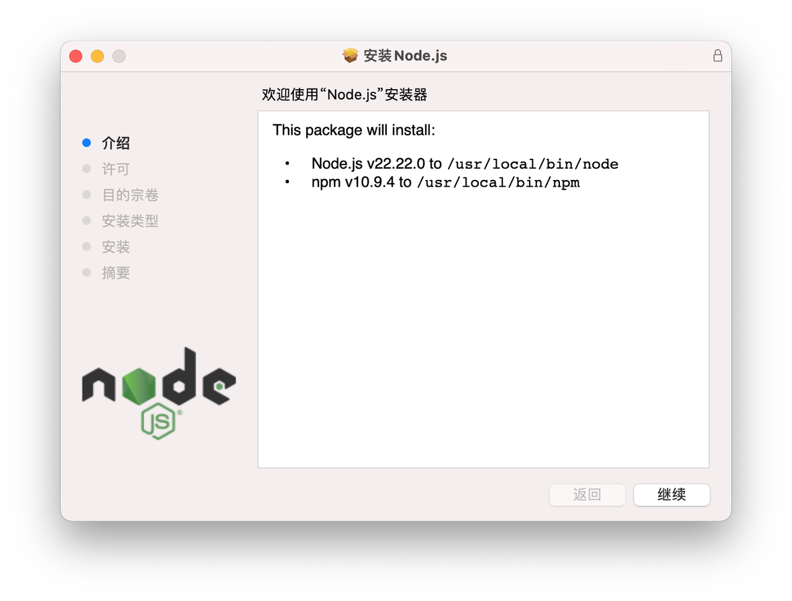

根据安装向导完成安装之后，node 和 npm 等命令会安装到 `/usr/local/bin` 下，此时要确认这个路径在 PATH 中，执行以下命令：

ZSH:

```bash
echo 'export PATH=/usr/local/bin:$PATH' >> ~/.zshrc
exec $SHELL
```

BASH:

```bash
echo 'export PATH=/usr/local/bin:$PATH' >> ~/.bashrc
exec $SHELL
```

NPM 国内加速设置：

```shell
npm config set registry https://registry.npmmirror.com/
```

验证安装结果：

```shell
$ node -v
v22.22.0

$ npm -v
10.9.4

$ npm config get registry
https://registry.npmmirror.com/
```

下一步检查 `node_modules` 文件夹的权限，该文件夹默认安装在 /usr/local/lib/node_modules，请使用以下命令检查目录权限：

```shell
$ ls -l /usr/local/lib/node_modules
drwxr-xr-x	8	root	wheel	256 1 13 04:55 corepack
drwxr-xr-x	12	root	wheel	256 1 13 04:55 npm
```

如果输出的权限如上所示是 `root:wheel` 的话，则需要修复目录权限，命令如下：

```shell
sudo chown -R $USER /usr/local/lib/node_modules
```


#### 安装 Gum

Gum是终端美化神器，OpenClaw 命令行工具在 Gum 已安装的情况下，终端交互界面会非常友好和美观，建议安装。

**第一种方式**：使用 Homebrew 安装，命令如下：

```
brew install gum
```

注意，如果你的操作系统版本官方已不再支持的话，你会收到 Homebrew 的以下提醒，并且很有可能会通过源码编译的方式在本机安装软件和依赖。此时最好放弃这个安装方法，直接到 Node 官网寻找预编译的安装包。

> [!warning]
>
> Warning: You are using macOS 12. We (and Apple) do not provide support for this old version.

**第二种方式**：使用官方预编译的安装包

从 [Releases · charmbracelet/gum](https://github.com/charmbracelet/gum/releases) 页面下载最新版本的预编译包。例如 0.17.0 版本对应的 macOS 平台 Intel 芯片的预编译包为 [gum_0.17.0_Darwin_x86_64.tar.gz](https://github.com/charmbracelet/gum/releases/download/v0.17.0/gum_0.17.0_Darwin_x86_64.tar.gz)，下载到本地之后使用以下命令解压和安装：

```shell
tar -zxvf gum_0.17.0_Darwin_x86_64.tar.gz
sudo mv gum_0.17.0_Darwin_x86_64/gum /usr/local/bin
sudo chmod +x /usr/local/bin/gum
```

验证安装结果：

```shell
$ gum --version
gum version v0.17.0 (6045525)
```


#### 安装 OpenClaw

OpenClaw 提供了一键安装部署和升级命令：

```shell
curl -fsSL https://openclaw.ai/install.sh | bash
```

以上命令在安装完 OpenClaw 之后会自动启动配置向导，若要禁用它的话，可换做下面的命令：

```shell
curl -fsSL https://openclaw.ai/install.sh | bash -s -- --no-onboard
```

验证安装结果：

```shell
$ openclaw --version
2026.2.26
```

配置向导的步骤将在配置章节介绍。


#### 平台兼容性

##### Node 版本兼容性

OpenClaw 官方要求 Node 版本不低于22，而不同 Node 版本对 macOS 操作系统的版本要求也不一样。如果用户误安装了不匹配的版本，将会得到与下面类似的错误信息：

```shell
$ node -v
dyld: Symbol not found: __ZNKSt3__115basic_stringbufIcNS_11char_traitsIcEENS_9allocatorIcEEE3strEv
  Referenced from: /usr/local/bin/node (which was built for Mac OS X 13.5)
  Expected in: /usr/lib/libc++.1.dylib

zsh: abort      node -v
```

关于 Node 和 macOS 的版本兼容性，请参考如下对照表，并按照实际情况选择合适的 Node 版本进行安装。

| macOS 版本           | Node v22 (LTS) | Node v23 | Node v24 (LTS) | Node v25 |
| -------------------- | -------------- | -------- | -------------- | -------- |
| macOS 15 Sequoia     | ✔️              | ✔️        | ✔️              | ✔️        |
| macOS 14 Sonoma      | ✔️              | ✔️        | ✔️              | ✔️        |
| macOS 13 Ventura     | ✔️              | ✔️        | ✔️              | ✔️        |
| macOS 12 Monterey    | ✔️              | ✔️        |                |          |
| macOS 11 Big Sur     | ✔️              | ✔️        |                |          |
| macOS 10.15 Catalina | ✔️              |          |                |          |

> [!tip]
>
> 更多兼容性参考：[Node.js — Node.js v22 to v24](https://nodejs.org/en/blog/migrations/v22-to-v24)

##### macOS 应用兼容性

macOS 应用是 OpenClaw 的**菜单栏配套工具**。它拥有权限管理, 在本地管理/附加到网关(launchd 或手动),并将 macOS 功能作为节点暴露给代理。作为 OpenClaw 命令行工具的补充，以下是应用可以提供的主要能力：

- 在菜单栏中显示原生通知和状态。
- 拥有 TCC 权限提示(通知、辅助功能、屏幕录制、麦克风、 语音识别、自动化/AppleScript)。
- 运行或连接到网关(本地或远程)。
- 暴露 macOS 专有工具(Canvas、Camera、Screen Recording、`system.run`)。
- 在**远程**模式下启动本地节点主机服务(launchd),在**本地**模式下停止它。
- 可选托管 **PeekabooBridge** 用于 UI 自动化。
- 根据请求通过 npm/pnpm 安装全局 CLI(`openclaw`)

这个应用对 macOS 平台版本有具体的兼容要求如下：

| 组件     | 版本                |
| -------- | ------------------- |
| 操作系统 | macOS Sequoia 15.6+ |
| Xcode    | 26.2+               |
| Swift    | 6.2+                |

所以理论上Mac电脑如果允许升级到 macOS 15.6+的话，可以体验额外的功能。但对于那些无法获得苹果官方的系统升级支持的老旧机器来说，这部分的功能就无法体验到了。


### Windows 平台（WSL2）

Windows 平台下推荐在 WSL2 (Windows Subsystem Linux) 下安装 Ubuntu 24.04 以获得近似于在 macOS 下的使用体验。

> [!note]
>
> 本章节除“安装 WSL2”之外，其余内容均适用于 Linux 平台 （Ubuntu）下的安装过程。

#### 安装 WSL2

首先查看 WSL2 目前提供的可供安装的 Linux 发行版有哪些：

```powershell
$ wsl --list --online
以下是可安装的有效分发的列表。
使用“wsl.exe --install <Distro>”安装。

NAME                            FRIENDLY NAME
Ubuntu                          Ubuntu
Ubuntu-24.04                    Ubuntu 24.04 LTS
openSUSE-Tumbleweed             openSUSE Tumbleweed
openSUSE-Leap-16.0              openSUSE Leap 16.0
SUSE-Linux-Enterprise-15-SP7    SUSE Linux Enterprise 15 SP7
SUSE-Linux-Enterprise-16.0      SUSE Linux Enterprise 16.0
kali-linux                      Kali Linux Rolling
Debian                          Debian GNU/Linux
AlmaLinux-8                     AlmaLinux OS 8
AlmaLinux-9                     AlmaLinux OS 9
AlmaLinux-Kitten-10             AlmaLinux OS Kitten 10
AlmaLinux-10                    AlmaLinux OS 10
archlinux                       Arch Linux
FedoraLinux-43                  Fedora Linux 43
FedoraLinux-42                  Fedora Linux 42
eLxr                            eLxr 12.12.0.0 GNU/Linux
Ubuntu-20.04                    Ubuntu 20.04 LTS
Ubuntu-22.04                    Ubuntu 22.04 LTS
OracleLinux_7_9                 Oracle Linux 7.9
OracleLinux_8_10                Oracle Linux 8.10
OracleLinux_9_5                 Oracle Linux 9.5
openSUSE-Leap-15.6              openSUSE Leap 15.6
SUSE-Linux-Enterprise-15-SP6    SUSE Linux Enterprise 15 SP6
```

其中 Ubuntu 和 Ubuntu-24.04 指向的都是 24.04 版本，下面安装 Ubuntu 发行版：

```
wsl --install Ubuntu
```

期间会提示输入账号和密码，按照提示进行设置即可。


#### 安装 Node

通过配置 NodeSource 源来安装 Node 24.14.0 LTS 版本，首先安装前置依赖包：

```shell
sudo apt install -y curl ca-certificates gpg
```

导入 NodeSource GPG Key：

```shell
sudo install -m 0755 -d /etc/apt/keyrings
curl -fsSL https://deb.nodesource.com/gpgkey/nodesource-repo.gpg.key | sudo gpg --dearmor --batch --yes -o /etc/apt/keyrings/nodesource.gpg
```

设置 NodeJS 版本（24 LTS):

```shell
NODE_MAJOR=24
cat <<EOF | sudo tee /etc/apt/sources.list.d/nodesource.sources
Types: deb
URIs: https://deb.nodesource.com/node_$NODE_MAJOR.x
Suites: nodistro
Components: main
Signed-By: /etc/apt/keyrings/nodesource.gpg
EOF
```

更新软件仓库：

```shell
sudo apt update
```

确认仓库配置的 NodeJS 版本：

```shell
$ apt-cache policy nodejs | sed -n '1,8p'
nodejs:
  Installed: 24.14.0-1nodesource1
  Candidate: 24.14.0-1nodesource1
  Version table:
 *** 24.14.0-1nodesource1 500
        500 https://deb.nodesource.com/node_24.x nodistro/main amd64 Packages
        100 /var/lib/dpkg/status
     24.13.1-1nodesource1 500
```

安装 NodeJS:

```shell
sudo apt install -y nodejs
```

NPM 国内加速设置：

```shell
npm config set registry https://registry.npmmirror.com/
```

验证安装结果：

```shell
$ node -v
v24.14.0

$ npm -v
11.9.0

$ npm config get registry
https://registry.npmmirror.com/
```

> 安装过程参考资料：[How to Install Node.js on Ubuntu (26.04, 24.04, 22.04) - LinuxCapable](https://linuxcapable.com/how-to-install-node-js-on-ubuntu-linux/)


#### 安装 Gum

官方安装指引：[charmbracelet/gum: A tool for glamorous shell scripts 🎀](https://github.com/charmbracelet/gum?tab=readme-ov-file#installation)

对于 Ubuntu 系统，安装步骤如下：

```shell
sudo mkdir -p /etc/apt/keyrings
curl -fsSL https://repo.charm.sh/apt/gpg.key | sudo gpg --dearmor -o /etc/apt/keyrings/charm.gpg
echo "deb [signed-by=/etc/apt/keyrings/charm.gpg] https://repo.charm.sh/apt/ * *" | sudo tee /etc/apt/sources.list.d/charm.list
sudo apt update && sudo apt install gum
```

验证安装结果：

```
$ gum --version
gum version v0.17.0 (6045525)
```


#### 安装 OpenClaw

OpenClaw 提供了一键安装部署和升级命令：

```shell
curl -fsSL https://openclaw.ai/install.sh | bash
```

以上命令在安装完 OpenClaw 之后会自动启动配置向导，若要禁用它的话，可换做下面的命令：

```shell
curl -fsSL https://openclaw.ai/install.sh | bash -s -- --no-onboard
```

验证安装结果：

```shell
$ openclaw --version
2026.2.26
```

配置向导的步骤将在配置章节介绍。


## 配置指引

### 大模型选择

在运行配置向导之前，需要选择合适的大模型用于 OpenClaw 的自然语言对话及推理。针对国内使用，OpenClaw 官方推荐使用 MiniMax 作为推理模型。

#### 注册 MiniMax 账号

访问 [MiniMax](https://www.minimaxi.com/)，点击右上角登录按钮，点击 API 开放平台。

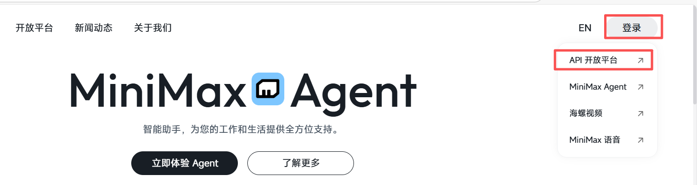

选择“手机验证码登录”

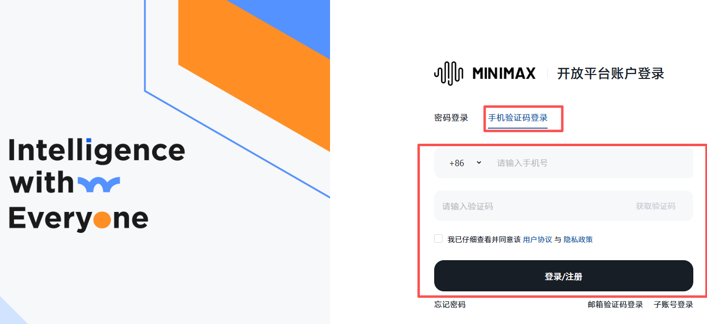

注册成功之后页面会转至开放平台主页，初次使用时，MiniMax 会**赠送15元代金券和7天免费试用的 Coding Plan**。因此在7天之内，开发者可以免费使用 MiniMax。下一章节将运行配置向导来配置该大模型。


### 运行配置向导

执行以下命令启动配置向导：

```shell
openclaw onboard
```

终端将会看到如下界面：

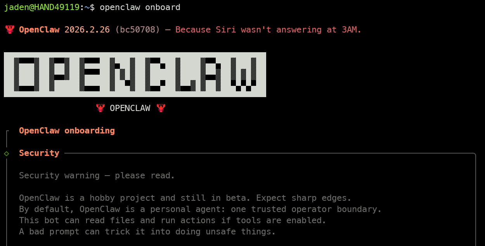

接下来会有一系列的交互式设置项，下面逐一来设置：

- I understand this is personal-by-default and shared/multi-user use requires lock-down. Continue? [**Yes**]

- Onboarding mode [**QuickStart**]

- Model/auth provider [**MiniMax**]

- MiniMax auth method [**MiniMax OAuth**]

- Select MiniMax endpoint [**CN**]


此时会提醒打开一个认证授权的地址：

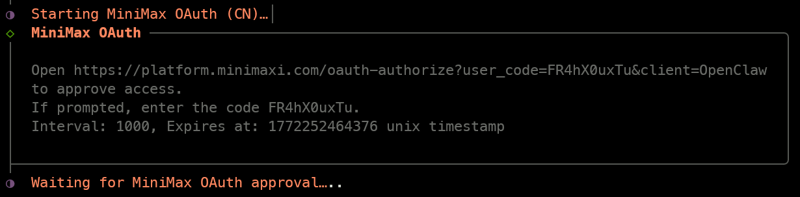

在浏览器打开它，点击授权按钮

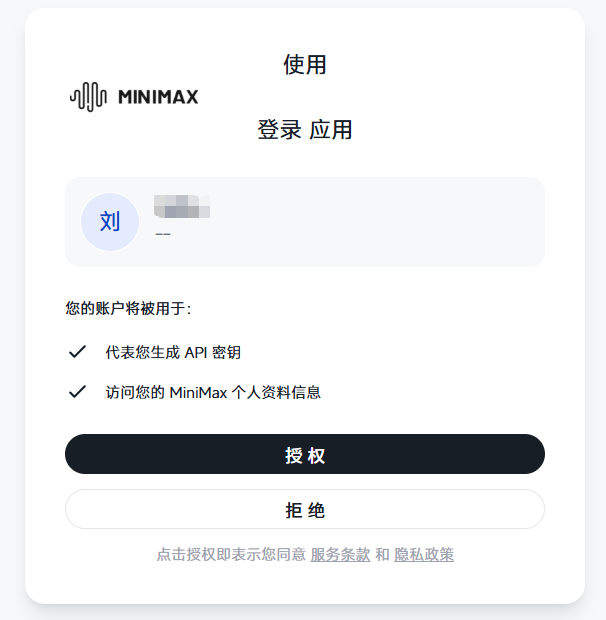

回到配置向导终端，已经可以看到认证成功的提示：

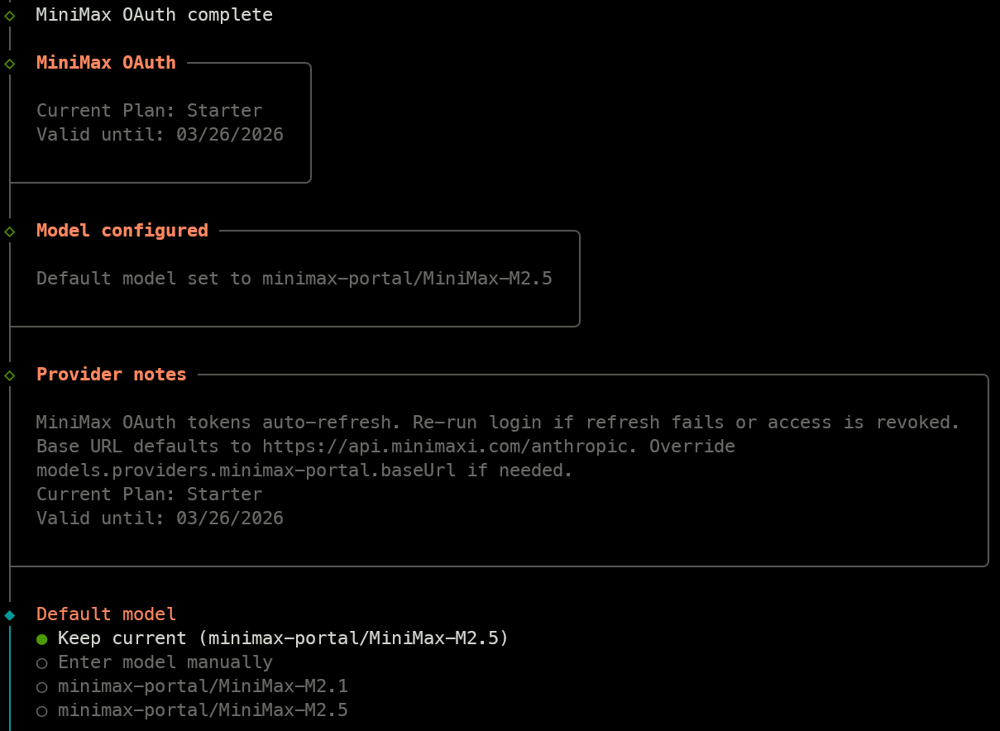

继续完成设置：

- Default model [**Keep current (minimax-portal/MiniMax-M2.5)**]
- Select channel (QuickStart) [**Skip for now**]
  - 消息频道将会在后面配置，此处先选择跳过
- Configure skills now? (recommended) [**Yes**]
- Install missing skills dependencies
  - clawhub: 自动搜索下载 skills，比较实用
  - mcporter：MCP 调用

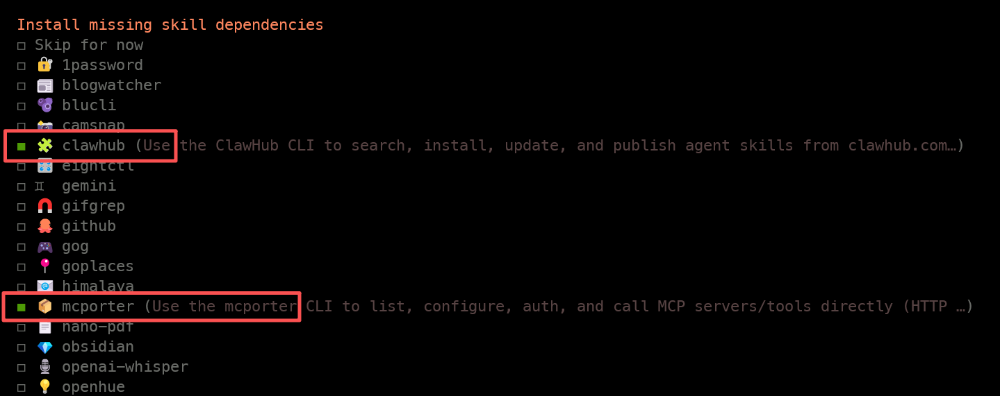

- Preferred node manager for skill installs [**npm**]
- Set GOOGLE_PLACES_API_KEY for goplaces? [**No**]
- Set GEMINI_API_KEY for nano-banana-pro? [**No**]
- Set NOTION_API_KEY for notion? [**No**]
- Set OPENAI_API_KEY for openai-image-gen? [**No**]
- Set OPENAI_API_KEY for openai-whisper-api? [**No**]
- Set ELEVENLABS_API_KEY for sag? [**No**]
- Enable hooks? [**Skip for now**]
- How do you want to hatch your bot? [**Do this later**]
  - 后面将以 Gateway Web 的方式启动网关。

至此已完成了初次使用时的配置向导步骤。


### 启动网关

在配置向导完成之后，OpenClaw 会自动安装网关服务并启动。在终端输入以下命令来获取访问网关服务的 URL：

```shell
$ openclaw dashboard

🦞 OpenClaw 2026.2.26 (bc50708) — Gateway online—please keep hands, feet, and appendages inside the shell at all times.

Dashboard URL: http://127.0.0.1:18789/#token=1ee49161bbe630bee0cc05efc8edbcc9bd51045aebdeef34
Copied to clipboard.
No GUI detected. Open from your computer:
ssh -N -L 18789:127.0.0.1:18789 jaden@<host>
Then open:
http://localhost:18789/
http://localhost:18789/#token=1ee49161bbe630bee0cc05efc8edbcc9bd51045aebdeef34
Docs:
https://docs.openclaw.ai/gateway/remote
https://docs.openclaw.ai/web/control-ui
```

其中 Dashboard URL 后面的地址 http://127.0.0.1:18789/#token=1ee49161bbe630bee0cc05efc8edbcc9bd51045aebdeef34 即为网关服务的访问地址。我们在 Windows 宿主机的浏览器中打开它：

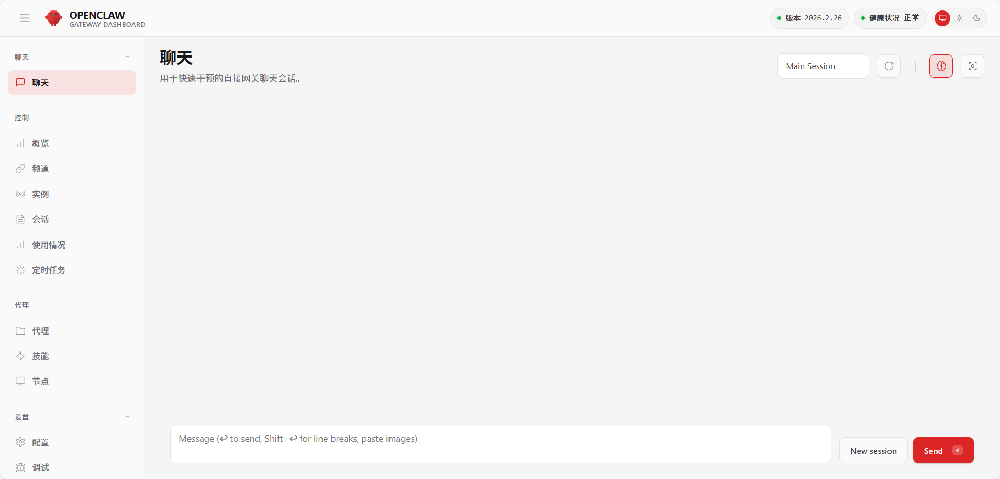

在聊天框中输入：**你使用的模型是什么？**OpenClaw 响应如下：

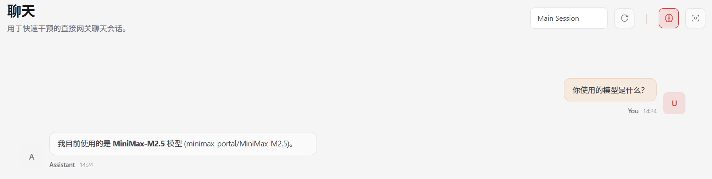

继续输入：1分钟后提醒我继续编写文档。

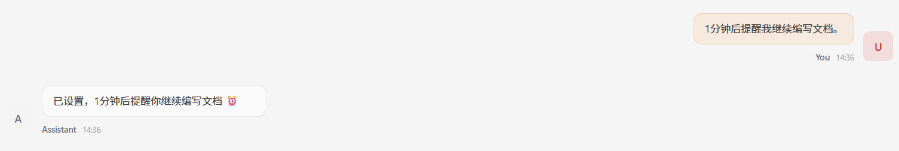

切换到定时任务功能之后可以看到，OpenClaw 自动为我们创建了一个一分钟之后的定时任务：

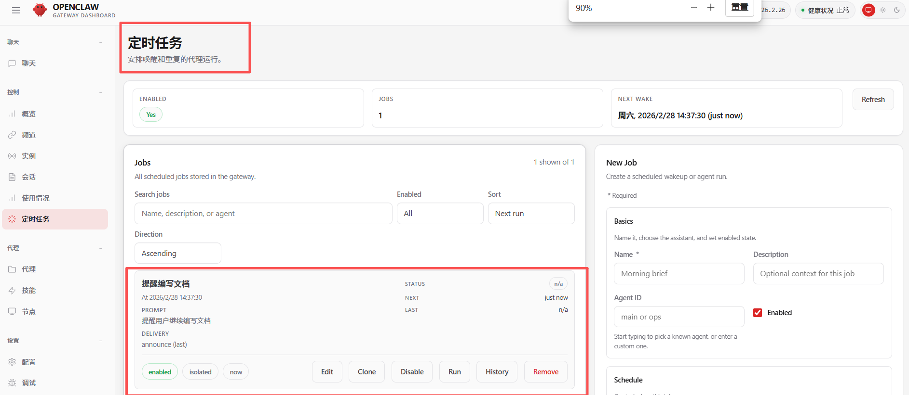


至此，OpenClaw 网关已经启动成功并且正常工作。其他对于网关服务的命令，譬如重启，停止，重新安装等等命令如下所示：

```shell
# 重启网关
openclaw gateway restart

# 停止网关
openclaw gateway stop

# 重新安装网关服务
openclaw gateway install
```


### 安装常见的 Skills

openclaw 在配置向导过程中会让用户勾选一些内置的 skill 工具，但数量和作用有限。通常情况下，我们要去  ClawHub （类似于 Docker Hub）上去按需搜索需要的技能，然后安装到 OpenClaw。

#### 安装 ClawHub

使用以下命令安装 clawhub:

```
npm install -g clawhub
```

为避免频繁出现“**Rate limit exceeded**”的错误，最好的解决方法是注册一个 clawhub 的账号，然后使用 `clawhub login` 登录你自己的账号之后，再使用 `clawhub install` 安装其他 Skills。典型的安装示例如下：

```
clawhub install self-improving-agent
```


#### 常见的 Skills

1. self-improving-agent
2. skill-creator
3. document-skills
4. find-skills
5. frontend-design
6. code-simplifier
7. ralph-loop
8. travily-search

更多的 Skills 可以访问 ClawHub：[ClawHub Skills](https://clawhub.ai/skills?sort=downloads)

> [!tip]
>
> 安装了 ClawHub 之后，OpenClaw 就具备了自动从 ClawHub 搜索和安装 Skills 的能力。


### 配置消息频道

OpenClaw 利用消息频道（Channel）可以与主流的即时通讯软件集成，用户可以在已连通的计时通讯软件上与 OpenClaw 进行对话和命令的下达。目前支持的计时通讯软件包括 WhatsApp、Telegram、Slack、LINE、飞书、企业微信等等。下面以飞书和 WhatsApp 为例来说明 OpenClaw 配置消息频道的流程。

#### 飞书

##### 新建应用

浏览器访问 [飞书开放平台](https://open.feishu.cn/)，点击右上角“开发者后台”按钮，之后点击“创建企业自建应用”按钮。

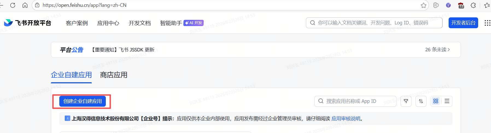

输入以下信息：

| 应用名称 | 应用描述          | 应用图标    |
| -------- | ----------------- | ----------- |
| 小飞     | OpenClaw 应用助手 | RobotFilled |

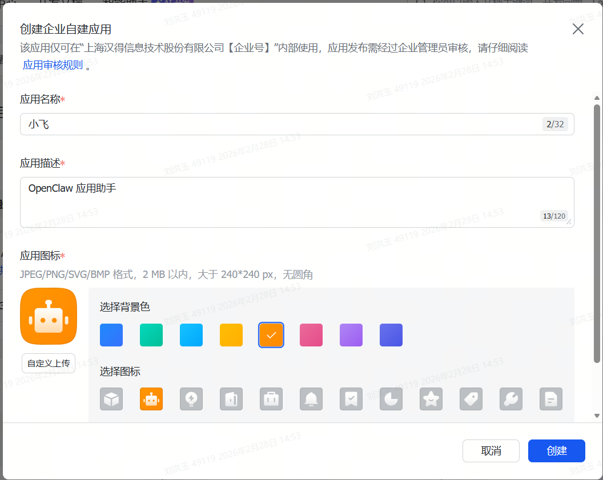

点击“创建”按钮完成。

##### 添加能力

回到主页，点击“小飞”应用图标进入设置界面。点击左侧侧边栏的“添加应用能力”，添加“机器人”。

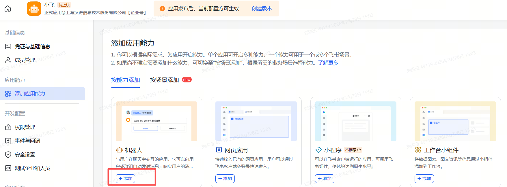

##### 权限管理

> 导航路径：开发配置 > 权限管理
>

点击“批量导入/导出权限”按钮，在“导入”页签填入以下权限的 JSON 格式信息：

```json
{
  "scopes": {
    "tenant": [
      "cardkit:card:write",
      "contact:contact.base:readonly",
      "contact:user.base:readonly",
      "drive:file:upload",
      "im:chat",
      "im:message",
      "im:message.group_at_msg:readonly",
      "im:message.group_msg",
      "im:message.p2p_msg:readonly",
      "im:message.pins:read",
      "im:message.pins:write_only",
      "im:message.reactions:read",
      "im:message.reactions:write_only",
      "im:message.urgent",
      "im:message.urgent.status:write",
      "im:message:readonly",
      "im:message:send_as_bot",
      "im:message:send_multi_depts",
      "im:message:send_multi_users",
      "im:message:send_sys_msg",
      "im:message:update",
      "im:resource"
    ],
    "user": []
  }
}
```

其中**“cardkit:card:write”（创建与更新卡片）**权限需要管理员审核，其他均为免审权限。

最后点击“**下一步，确认新增权限**”按钮进入“确认导入权限”步骤，此时会显示上面 JSON 内容中所包含的所有权限，如下图所示：

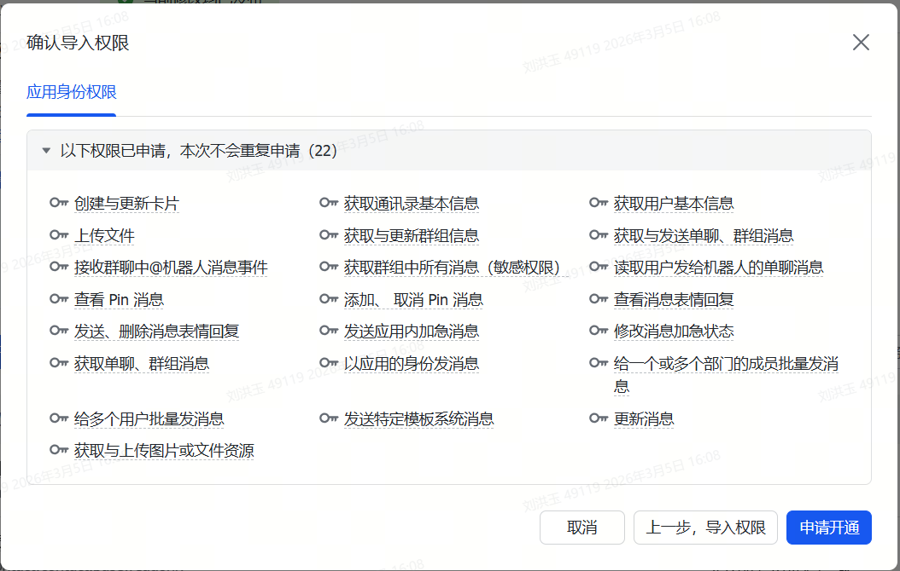

点击“**申请开通**”按钮完成权限的添加。


##### 发布应用

在页面顶部点击“创建版本”链接：

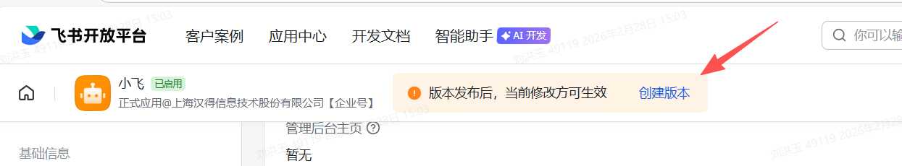

填入版本号和更新说明：

- 版本号：1.0.0
- 更新说明：初版

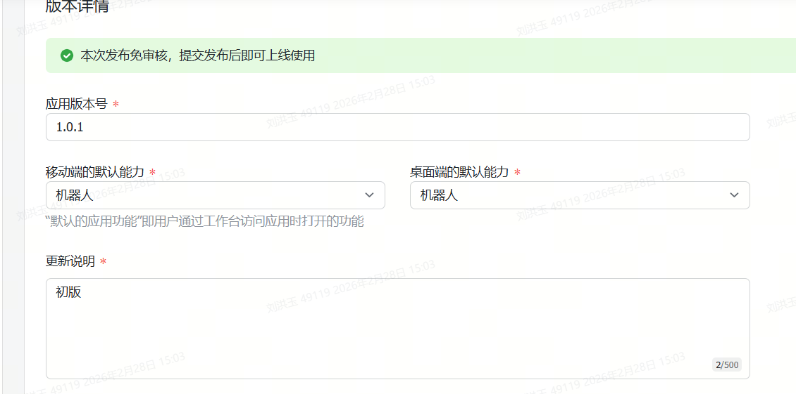

点击“保存”按钮完成版本发布。

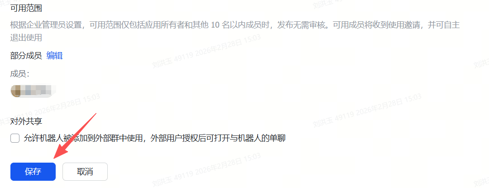

##### 配置 OpenClaw

> 导航路径：基础信息 > 凭证与基础信息
>

拷贝 **App ID** 和 **App Secret**

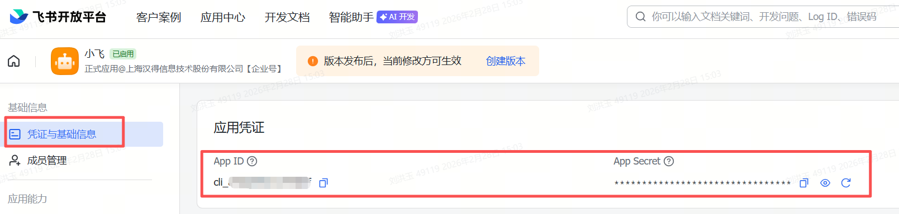

回到终端，运行 `openclaw channels add` 命令进入交互式配置流程，配置项设置如下：

- Configure chat channels now? [**Yes**]
- Select a channel [**Feishu/Lark (飞书)**]

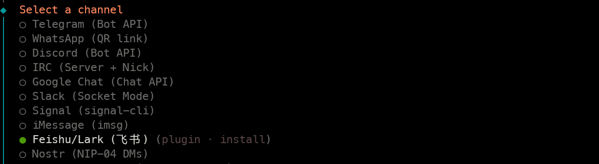

- Install Feishu plugin? [**Download from npm (@openclaw/feishu)**]

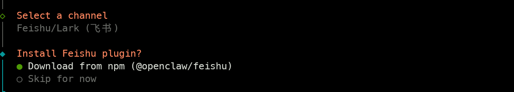

之后输入刚刚拷贝的 App ID 和 App Secret：

- Enter Feishu App ID [**App ID**]
- Enter Feishu App Secret [**App Secret**]

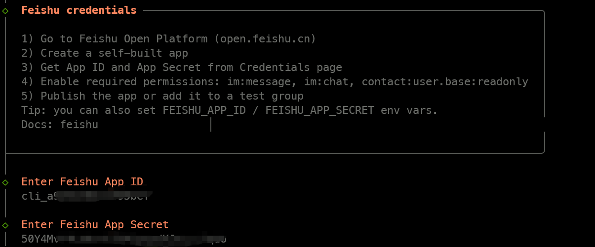

接下来 OpenClaw 会测试连接是否成功：

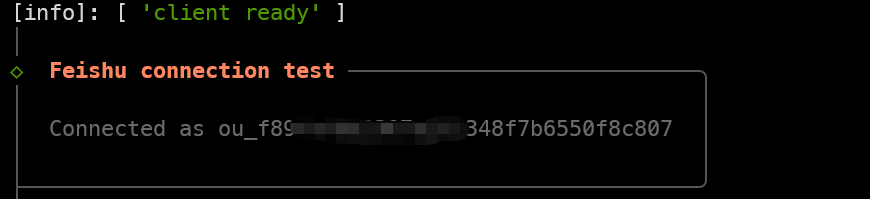

- Which Feishu domain? [**Feishu (feishu.cn) - China**]


- Group chat policy [**Open - respond in all groups (requires mention)**]

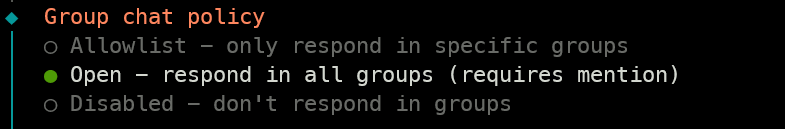

- Select a channel [**Finished**]
- Configure DM access policies now? (default: pairing) [**No**]
- Add display names for these accounts? (optional) [**No**]
- Bind configured channel accounts to agents now? [**No**]

重启网关服务：

```shell
openclaw gateway restart
```

配置完成。


##### 事件与回调

> 导航路径：开发配置 > 事件与回调

回到飞书开放平台，点击左侧侧边栏的“事件与回调”，点击“事件配置”页签，界面如下所示：

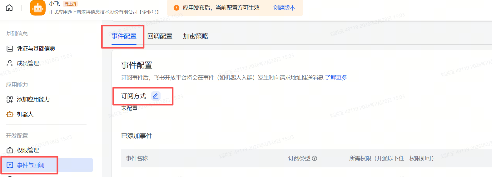

点击“订阅方式”右侧的铅笔图标，订阅方式选择默认的“使用 **长连接** 接收事件”选项，点击保存按钮。

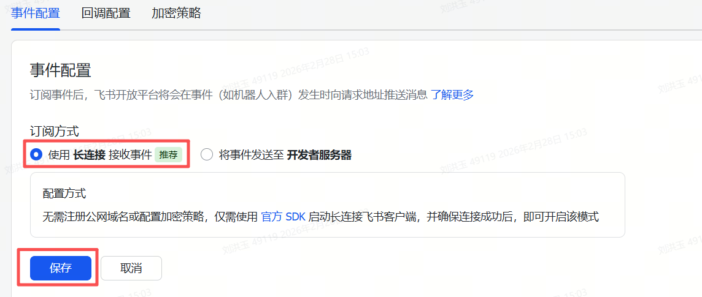

点击“添加事件”按钮：

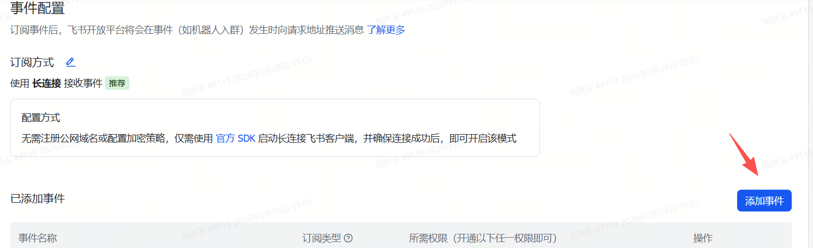

搜索“接收消息”，选中，点击“确认添加”按钮。

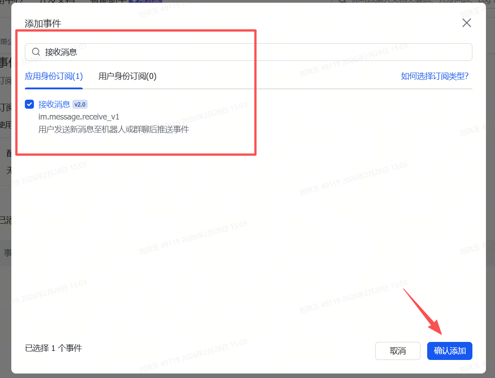

##### 再次发布应用

- 应用版本号：**1.0.1**
- 更新说明：**添加机器人事件回调。**


##### 开始对话

在飞书中搜索“小飞”机器人。

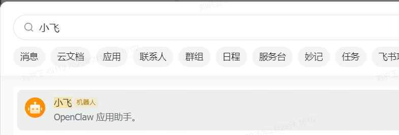

发送消息：“1分钟后提醒我：“飞往月球”，OpenClaw 回复：


#### WhatsApp

由于 WhatsApp 在国内无法访问，因此全程需要进行“魔法上网”。此外，OpenClaw 的 WhatsApp 频道对VPN代理设置检测不到，例如你在终端设置了：

```shell
export https_proxy=http://127.0.0.1:7890;export http_proxy=http://127.0.0.1:7890;export all_proxy=socks5://127.0.0.1:7890
```

openclaw 和 Web 网关均无法识别以上配置，网上有临时解决方法：

>[!note]
>
>通过临时修改 
>
>dist/ 目录下的 session-*.js 来临时让 OpenClaw 识别代理设置：
>
>[[Bug\]: Feature Request: Support for HTTP/SOCKS5 Proxy for WhatsApp (Baileys) Connection · Issue #2153 · openclaw/openclaw](https://github.com/openclaw/openclaw/issues/2153)
>
>

同时要求网关要以前台的方式运行方能生效：

```shell
openclaw gateway
```

下面开始 WhatsApp 的配置。


##### 注册 WhatsApp 账号

在全程魔法上网的前提下，下载 WhatsApp 移动端应用，点击注册，输入国内个人手机号，等待验证通过即可。


##### 运行配置向导

回到终端，运行 `openclaw channels add` 命令启动频道的配置向导。

- Configure chat channels now? [**Yes**]
- Select a channel [**WhatsApp (QR link)**]
- WhatsApp account [**default (primary)**]
- Link WhatsApp now (QR)? [**No**]
  - 选否是因为终端无法识别代理，需要经由网关的 Web 界面来完成。
- WhatsApp phone setup **[This is my personal phone number**]
- Your personal WhatsApp number (the phone you will message from) [注册 WhatsApp 的真实手机号： +86xxxxxxxxxxx]
- Select a channel [**Finished**]


##### 重启网关

停止网关后台服务：

```
openclaw gateway stop
```

终端设置代理：

```shell
export https_proxy=http://127.0.0.1:7890;export http_proxy=http://127.0.0.1:7890;export all_proxy=socks5://127.0.0.1:7890
```

前台启动网关：

```
openclaw gateway
```


##### 连接 WhatsApp

运行 `openclaw dashboard` 启动网关 Web 页面，导航至 **控制 > 频道**，找到 WhatsApp：

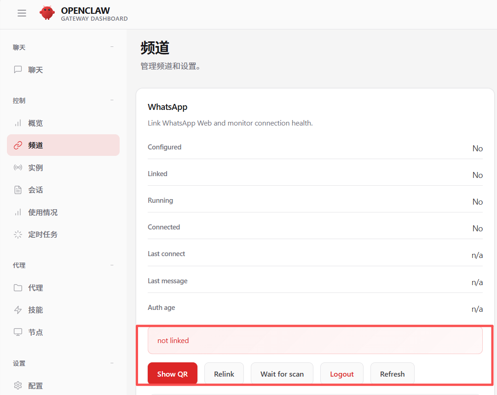


点击“Show QR”按钮生成二维码。注意，这一步需要保证魔法上网可用，才能正常显示。打开 WhatsApp 移动 APP，打开设置，在账户图标右侧点击二维码图标：

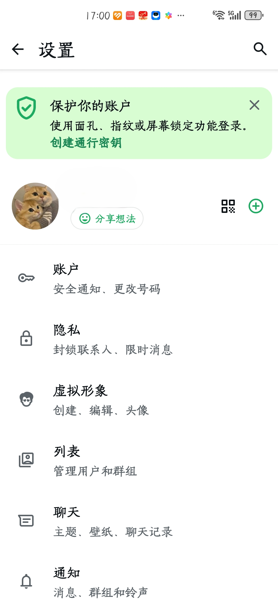

切换至“扫描二维码”页签，并扫描刚刚生成的二维码。


扫描完之后等待连接。

>[!tip]
>
>如果第一次扫码超时失败，那么后续再次扫描同一个二维码就会提示无法找到设备的错误。此时需要在网关的频道界面重新生成二维码，具体步骤为：
>
>1. 点击 Logout
>2. 点击 Show QR

假设连接成功之后，OpenClaw 就可以以你的身份与其他人或这你自己进行对话了。

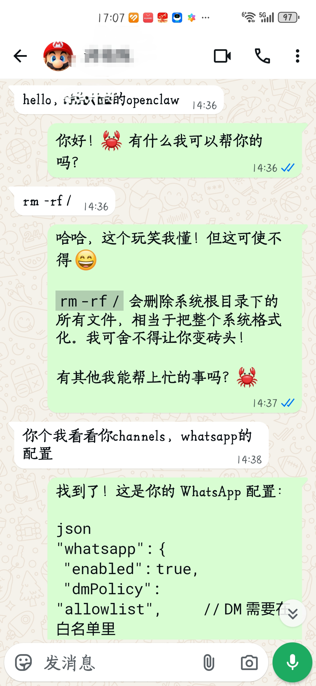

至此，WhatsApp 频道的连接配置已全部完成，更多的配置请参考 OpenClaw 的官方文档。

