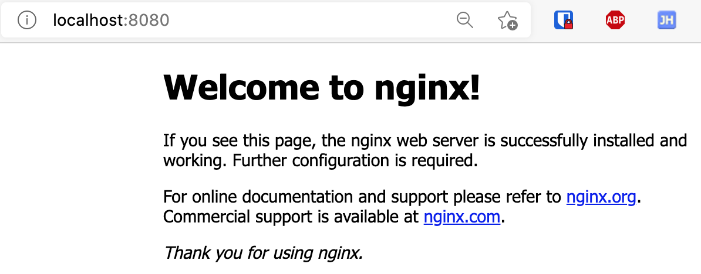

本文介绍如何使用 k3d 在本地快速启动一个 k8s 集群。k3d 是以容器的方式运行 K3s 集群的工具，K3s 是 Rancher 推出的经过 CNCF 认证的与 K8S 完全兼容的发行版，特点是轻量级，启动快，依赖少，适合边缘计算以及资源能力有限的机器上运行集群。k3d 的这种启动方式对平台依赖少，安装部署比较干净利落，理论上本地只需要一个 Docker 运行环境即可。

<!-- more -->

## 安装过程介绍

### 实验环境

- 操作系统：macOS Catalina (10.15.7)
- 容器环境：Docker Desktop for Mac 3.2.2
- 包管理工具：Homebrew

### 设置 Docker 镜像加速

打开 Docker Desktop for Mac 的首选项界面，选择 Docker Engine，加入如下设置：

```json
{
  "registry-mirrors": [
    "https://8km017g6.mirror.aliyuncs.com"
  ]
}
```

之后点击 `Apply & Restart` 重启 Docker。

### 安装 k3d 和 kubectl

k3d 并不依赖于 kubectl，但是开发人员需要 kubectl 与 k3d 所创建的 k8s 集群进行通讯：

```shell
$ brew install kubectl
$ brew install k3d
```

### 创建 k8s 集群

使用 `k3d cluster create` 命令即可新建集群，同样 k3d 也支持通过命令行选项传入更多的可选参数，此外，也可以经由一个 YAML 配置文件来统一进行配置。下面我们重点介绍以下后者的启动方式。

新建一个 YAML 格式的配置文件 `mycluster.yaml` 如下：

```yaml
apiVersion: k3d.io/v1alpha2
kind: Simple
name: mycluster
servers: 1
agents: 2
kubeAPI:
  hostPort: "6443" # same as `--api-port '6443'`
ports:
  - port: 8080:80  # same as `--port '8080:80@loadbalancer'`
    nodeFilters:
      - loadbalancer
  - port: 8443:443 # same as `--port '8443:443@loadbalancer'`
    nodeFilters:
      - loadbalancer
```

上面的配置文件指定了集群的名称、集群的节点个数（servers, agents) 以及向主机暴露的端口，更多的配置参数介绍请访问 [Config File - k3d](https://k3d.io/usage/configfile/)。

接下来我们使用上面的配置文件 `mycluster.yaml` ，通过向 k3d 传入 `--config` 参数来创建我们的集群：

```shell
$ k3d cluster create --config /path/to/mycluster.yaml
INFO[0000] Using config file mycluster.yaml
INFO[0000] Prep: Network
INFO[0000] Created network 'k3d-mycluster'
INFO[0000] Created volume 'k3d-mycluster-images'
INFO[0001] Creating node 'k3d-mycluster-server-0'
INFO[0001] Creating node 'k3d-mycluster-agent-0'
INFO[0001] Creating node 'k3d-mycluster-agent-1'
INFO[0001] Creating LoadBalancer 'k3d-mycluster-serverlb'
INFO[0001] Starting cluster 'mycluster'
INFO[0001] Starting servers...
INFO[0001] Starting Node 'k3d-mycluster-server-0'
INFO[0007] Starting agents...
INFO[0007] Starting Node 'k3d-mycluster-agent-0'
INFO[0020] Starting Node 'k3d-mycluster-agent-1'
INFO[0028] Starting helpers...
INFO[0028] Starting Node 'k3d-mycluster-serverlb'
INFO[0029] (Optional) Trying to get IP of the docker host and inject it into the cluster as 'host.k3d.internal' for easy access
INFO[0031] Successfully added host record to /etc/hosts in 4/4 nodes and to the CoreDNS ConfigMap
INFO[0031] Cluster 'mycluster' created successfully!
INFO[0031] --kubeconfig-update-default=false --> sets --kubeconfig-switch-context=false
INFO[0031] You can now use it like this:
kubectl config use-context k3d-mycluster
kubectl cluster-info
```

接下来我们使用 `kubectl` 来查看集群 `mucluster` 中的基本信息：

```shell
$ kubectl get nodes
NAME                     STATUS   ROLES                  AGE   VERSION
k3d-mycluster-server-0   Ready    control-plane,master   29m   v1.20.2+k3s1
k3d-mycluster-agent-0    Ready    <none>                 29m   v1.20.2+k3s1
k3d-mycluster-agent-1    Ready    <none>                 29m   v1.20.2+k3s1

$ kubectl get pods -n kube-system
NAME                                      READY   STATUS      RESTARTS   AGE
local-path-provisioner-7c458769fb-sr8dk   1/1     Running     0          29m
metrics-server-86cbb8457f-t6kgk           1/1     Running     0          29m
coredns-854c77959c-fnlsh                  1/1     Running     0          29m
helm-install-traefik-cbwv7                0/1     Completed   0          29m
svclb-traefik-pf5fz                       2/2     Running     0          28m
svclb-traefik-5ctqj                       2/2     Running     0          28m
svclb-traefik-fqdzl                       2/2     Running     0          28m
traefik-6f9cbd9bd4-lpxvw                  1/1     Running     0          28m
```

至此，一个最基本的 k8s 集群就已经创建好了。

### 删除集群

使用以下命令删除上面已经创建的集群：

```shell
k3d cluster delete mycluster
```

### 部署测试应用

此处我们使用 k3d 官网提供的测试应用部署方法来启动一个 nginx：

```shell
$ kubectl create deployment nginx --image=nginx:alpine
deployment.apps/nginx created
$ kubectl create service clusterip nginx --tcp=80:80
service/nginx created

$ cat <<EOF | kubectl apply -f -
apiVersion: networking.k8s.io/v1
kind: Ingress
metadata:
  name: nginx
  annotations:
    ingress.kubernetes.io/ssl-redirect: "false"
spec:
  rules:
  - http:
      paths:
      - path: /
        pathType: Prefix
        backend:
          service:
            name: nginx
            port:
              number: 80
EOF
ingress.networking.k8s.io/nginx created
```

在浏览器打开 http://localhost:8080/ 



## 参考资料

- [k3d#installation](https://k3d.io/#installation)
- [Config File - k3d](https://k3d.io/usage/configfile/)
- [Exposing Services - k3d](https://k3d.io/usage/guides/exposing_services/#1-via-ingress-recommended)
- [如何在本地快速启动一个 K8S 集群 | xkcoding](https://xkcoding.com/2021/03/15/run-local-k8s-cluster-quickly.html)

