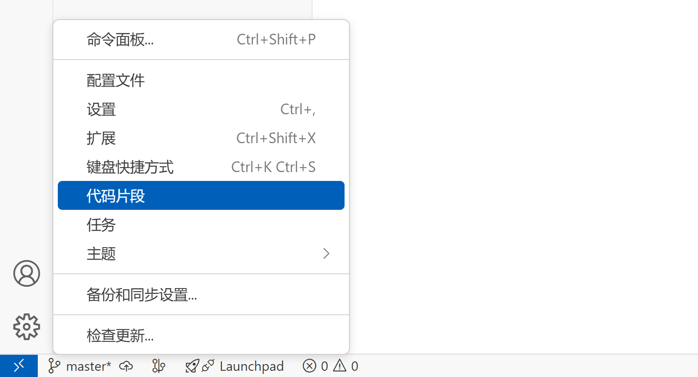
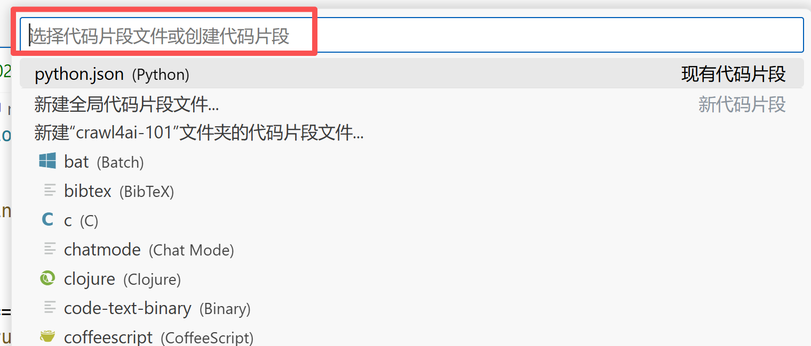

## 设置步骤

点击左下角齿轮图标，在弹出菜单中选择“代码片段”：



在代码片段文件下拉框中输入 `Python` 之后，点击回车键，之后将打开 `python.json` 配置文件。



接下来就可以添加常用的代码片段了。

<!-- more -->


## 常用代码片段

### ifmain

生成 main 函数入口，代码片段如下：

```json
"Main Autocomplete (Sync)": {
    "prefix": "ifmain",
    "body": [
        "def main():",
        "    ${1:pass}",
        "",
        "",
        "if __name__ == \"__main__\":",
        "    main()"
    ],
    "description": "Main function template (sync)"
}
```

效果如下：

```python
def main():
    pass # <-- 光标停留在此处


if __name__ == "__main__":
    main()
```


### ifma

生成适用于异步 main 函数入口，代码片段如下：

```json
"Main Autocomplete (Async)": {
    "prefix": "ifma",
    "body": [
        "import asyncio",
        "",
        "",
        "async def main():",
        "    ${1:pass}",
        "",
        "",
        "if __name__ == \"__main__\":",
        "    asyncio.run(main())"
    ],
    "description": "Main function template (async)"
}
```

效果如下：

```python
import asyncio


async def main():
    pass # <-- 光标停留在此处


if __name__ == "__main__":
    asyncio.run(main())
```

